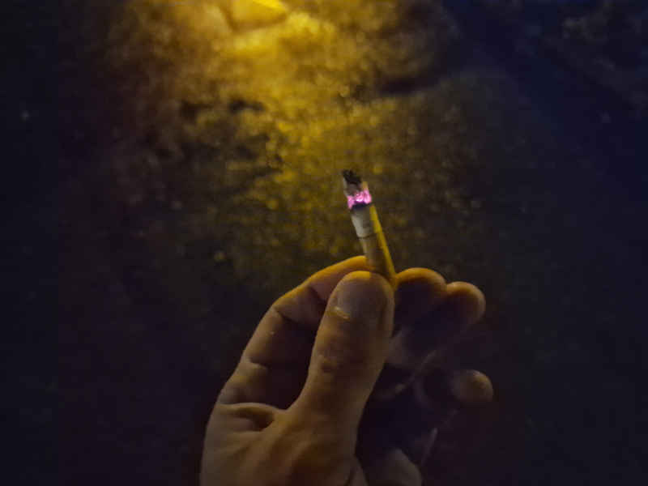
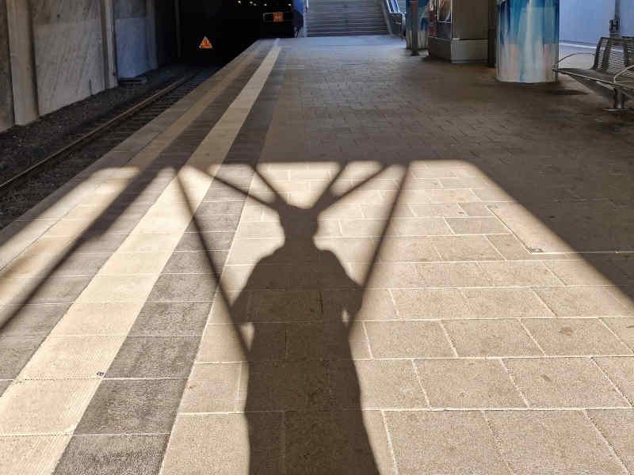
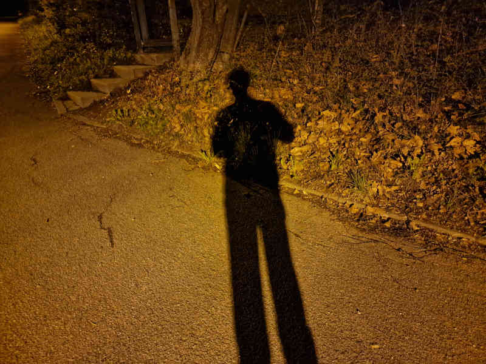

# About Me

## Table of Contents  <a id="1"/>

 - [Day-117](#17000) MPA-Final
 - [Day-115](#15000) Men-Women-Universe
 - [Day-114](#14000) Great Work, Anne!
 - [Day-113](#12300) Good Men and Women
 - [Day-111](#12000) Dussel in Dusslingen
 - [Day-110](#11000) Good old Buddies
 - [Day-109](#10900) Helping Friend with Fun
 - [Day-107](#10700) Driving-License is back
 - [Day-106](#10600) Movies again
 - [Day-98](#9800) Spinoza and Brass
 - [Day-96](#9600) Back-Spin, Medicine and Chestnut-Tree
 - [Day-95](#9500) Tennis-Supports and Land-Restoration
 - [Day-91](#9100) Freiburg Concert
 - [Day-90](#9000) Moral and Wimbledon
 - [Day-89](#8900) Diablo IV
 - [Day-79](#7900) MPA in Köln
 - [Day-77](#7700) Tennis with Hobby-Team
 - [Day-76](#7600) MPA-Plan for Cologne
 - [Day-74](#7400) MPA and Physics
 - [Day-72](#7200) Back to the Future
 - [Day-71](#7100) Movie "2 Fast 2 Furious"
 - [Day-70](#7000) About Moral
 - [Day-67](#6700) The Fast and the Furious
 - [Day-66](#6600) With Nicole again
 - [Day-64](#6400) Fast and Furious
 - [Day-53](#5300) Nicole is back
 - [Day-48](#4800) MPA Depression and Beurteilungs-Kriterien
 - [Day-47](#4700) MPA and Amts-Gericht-Tübingen
 - [Day-46](#4600) MPA and Hacker
 - [Day-45](#4500) Finish Smoking
 - [Day-44](#4400) Art-Karlsruhe
 - [Day-42](#4200) Just Day 42
 - [Day-41](#4100) Good-Life Day
 - [Day-40](#4000) Hair-Analysis and Double-Standards
 - [Day-39](#3900) Price for the Best
 - [Day-38](#3800) Round-Robin and Botanics
 - [Day-37](#3700) Sunday and Erster-Mai
 - [Day-36](#3600) Diana Short-Trip
 - [Day-35](#3500) Cigarette from Ukraine
 - [Day-34](#3400) Wimbledon, House-Dragon and MPA
 - [Day-33](#3300) Tennis and Citarettes (again)
 - [Day-32](#3200) Not Much
 - [Day-31](#3100) Chat-GPT
 - [Day-30](#3000) Starting Studies
 - [Day-29](#2900) Diana and Spanish
 - [Day-28](#2800) Entscheidungen und Handicaps
 - [Day-27](#2700) Juristics and Women
 - [Day-26](#2600) Starting Philosophy
 - [Day-25](#2500) Family, MPA and Medicine
 - [Day-24](#2400) Unbalanced Emotions
 - [Day-23](#2300) A first Mission-Statement
 - [Day-22](#2200) With Nicole again
 - [Day-21](#2100) A nice Day
 - [Day-20](#2000) Little except the Work
 - [Day-19](#1900) About Clothing
 - [Day-18](#1800) MPA again
 - [Day-17](#1700) Nothing
 - [Day-16](#1600) Smoking Family
 - [Day-15](#1600) Rendering 1
 - [Day-14](#1400) Money
 - [Day-13](#1300) Dangerous Sub-Modules
 - [Day-12](#1200) Two Universes
 - [Day-11](#1100) Romania, Pacistan & Clash of Clans
 - [Day-10](#1000) Beauty

## Day-117: MPA-Final <a id="17000"/>

#### Blog-Chain-Time 2023.11.02-14:00 at the Landrats-Amt  <a id="17002"/>
###### Topics: MPA, Politics, War, Peace, Women

Today I meet my dear [Mrs-N](1000001002.md) again to finally get back all my Driving-[Rights](670004.md) from [Our-Landrats-Amt](140100002.md). In the Office I also meet her [Boss](180000013.md), with whom I already had a "friendly" [Conversation](40202001.md) right at the [Beginning](60154.md) of my personal [Battle](1200000007.md) [[1]](#17051) with the [Paragraph-Riders](1200000006.md).

My [Impression](60041.md), that [Our-Strict-System](8000998.md) is *not* always fair to [Outsiders](180000014.md), was confirmed again some Minutes before, when I arrived with [My-Bulli](1971091102.md) and only one [Flag](141000009.md) was waving next to [Germany](140000025.md) in front of the [Landrats-Amt](250010001.md):


I can understand that also the [Family](180000008.md) of [Our-Mayor](70000069.md) might had to endure great [Suffering](10000111.md) due to [Crimes](670012.md) of the [National-Socialism](141000012.md), but can this *still* be a [Justification](600178.md) for this (at least for [Islamists](1200000004.md)) annoying [Provocation](41010010.md) in the multicultural [Tübingen](2000001.md)?

Well, since we don't have the [Tagblatt](2010040.md), I frankly admit my [Ignorance](600186.md) about the *real* [Facts](600181.md) behind this [Decision](60095.md) and the [Provocation](600078.md) of the (almost for sure) not *responsible* [Person](40000001.md) was just a simple [Trick](600187.md) for getting more [Publicity](60175.md), like [Master-Palmer](70000069.md) himself demonstrates it from Time to Time.

To be honest, in General I get most political [Information](60007.md) from [Colleagues](180000010.md), like my decided [Contenance-Trainer](1971091169.md), to whom I have at least more [Confidence](60015.md), than to eloquent [Jurists](670036.md), who (like he told me) get a big [Stage](60010007.md) from our so trustworthy [Public-Service-Broadcasters](191000003.md).

Howsoever, there are probably even more important [Topics](600051.md), like [Global-Warming](290000002.md) or [Waves](60156.md)...&nbsp;of [Refugees](141000013.md) and for me anyway at the Moment most [Relevance](600114.md) has the Settlement of yet another [MPA](1000001001.md)-[Bill](130000002.md):


In Order to save [Money](6666.md) and [Time](10000002.md) for future Candidates, I then discuss one of my [Ideas](600012.md), where the Son of [Mrs-N](1000001002.md) might help with his refurbished [Motor-Bike](200500003.md) from [Suzuki](240000025.md):


After a wordy [Whats-App](9000047.md)-[Disupte](600185.md) with two [Girl-Friends](180000002.md) about Right and Wrong, back at Home I proudly present our glory [Solution](600024.md) to my [My-Skeptical-Occupant](88.md) and get into the next [Battle](1200000007.md), because she is a *real* [Fighter](1200000005.md) against [Combustion-Engines](200400008.md)&nbsp;-&nbsp;but perhaps we can get [Cease-Fire](1200000008.md) by using [Electric-Motor-Bikes](200500006.md) with more [Respect](41000005.md) for the female [Nature](60104.md):


#### Blog-Chain-Time 2023.10.26-11:30 at the Fahrschule-Armbruster  <a id="17001"/>
###### Topics: 123-Friends, MPA, Feelings

After the stupid [Dussel-Test](#12000) Today I have my second [Exam](1100000002.md) to finally get back the [Motorbike-License](1100110001.md).

Due to [Illness](40800000.md) of the [Examiner](202000018.md) the [Testing](1100000002.md) was postponed and my last [Driving-Lesson](1100000014.md) is already a [Week](610008.md) ago&nbsp;-&nbsp;Now I feel little [Fear](10000109.md), that I have forgotten how to drive again.

Therefore, though the external [Conditions](60069.md) are almost perfect, because of [Nervousness](10000108.md) already at the first [Junction](1100000021.md) I take the wrong [Lane](100000022.md), which leads to [Connection](60006.md)-Problems with [Erik](150000005.md) and the [Examiner](202000018.md).

Fortunately shortly later we find ourself again [Am-Stadtgraben](2010039.md) and then drive to the [Training-Ground](1100100004.md), where this Time I behave like a *real* [Adult](670032.md) and pass all [Exercises](60138.md) without Problems.

Because I *really* feel [Relaxation](10000110.md) now, subsequently with high [Concentration](600145.md) I also manage the Rest of the [Program](60086.md) and finally arrive at our Starting-Point:


There I have a Talk with the next [Examinee](404.md) about our [MPA-Process](1000001001.md), where he tells me a short [Story](60109.md) about his [Friend](180000002.md), who obviously also had some [Problems](600029.md) with our beloved [German-System](8000998.md):

> After his first [MPA-Test](1000001001.md), he was told to be 6 Months abstinent from [Alcohol](100100006.md) and then in the second MPA-Meeting, where he had the Impression that even the [Psychology](14000000.md)-Part went fine, the [Experts](12000000.md) still demanded another 6 Months of [Abstinence](404.md).

Come on Girls, really? A least regarding the last Point I made exactly the same [Experience](600096.md) in my fourth MPA [[0]](#17050) with my special "Friends" from [Tüv-Süd-Balingen](1000001007.md).

On the one Hand I feel [Happiness](10000112.md), that I am not alone with my [Problem](600029.md), but on the other Hand I feel also [Sadness](10000113.md) to see even more [Suffering](10000111.md) from this crazy [System](60052.md).

Howsoever, at least for me this [Nightmare](404.md) seems to be finally over now, and shortly later I even feel even some [Gratitude](41000009.md), when I eat a Piece of [Pizza](203500001.md) together with two [Good-Men](20000100003.md), I will never forget:


### Footnotes

[<a id="17050"/>0] Beweismittel abgelehnt: [https://holzheu.de](https://www.holzheu.de/meine-erste-mpu-beweismittel-abgelehnt) \
[<a id="17051"/>1] Meine erste MPU: [https://holzheu.de](https://www.holzheu.de/category/recht/mpu)

## Day-115: Men-Women-Universe <a id="15000"/>

#### Blog-Chain-Time 2023.10.26-17:15 in Tübingen  <a id="15001"/>
###### Topics: Men, Women

Yesterday I had an [Argument](600151.md) about [Justice](600052.md) with my [My-Fellow-Occupant](88.md), where she made the [Claim](600078.md) that [Men](40080022.md) have much more [Contacts](10000039.md) with [Women](40000010.md) than the other Way round.

I respond, that this cannot be [The-Truth](600140.md), because for each [Contact](40000015.md) we normally have exactly one [Woman](40000010.md) and one [Man](40080022.md), so in total each [Group](180000000.md) must have the same [Number](60000.md) of [Contacts](40000015.md).

She pretends to me to not have understood my [Argumentation](600176.md), which of course cannot be [The-Truth](600140.md), because she is not bad at all in [Mathematics](13000000.md) and of course knows the [Formula](13000025.md) for the [Average-Ratio](12000060.md):

$$ Average(x_1,x_2 ..\:x_n) = \frac{\sum\limits_{i=1}^{n}{x_i}}{n} $$
$$ = \frac{x_1 + x_2 + .. + x_n}{n} $$

The next Day, after a Walk with [Soey](142000001.md), I meet [Sarah](151000002.md) together with her [Father](40000007.md). Both look like rather inexperienced [Mathematicians](80000002.md) to me and therefore I try to explain them as simple as possible, why [Men](40080022.md) and [Women](40000010.md) are equal regarding [Fun-Contacts](60170.md).

So let's assume we have a [Micro-Universe](10000027.md) with only two Men _M1/M2_ and two Women _W1/W2_, where _M1_ has two Contacts with each of _W1/W2_, whereas _M2_ has Zero-Contacts.

Because each of the two Women have one Time Fun with _M1_ the [Variables](13000042.md) for the [Function](13000011.md) have the following [Values](700030.md):

$$ x_1 = Fun\_Count\_W1 = 1 $$
$$ x_2 = Fun\_Count\_W2 = 1 $$
$$ n = Women\_Count = 2 $$

Then we can calculate _Fun_per_Woman_ as Follows:

$$ Fun\_per\_Woman = Average(x_1,x_2) $$
$$ =  \frac{\sum\limits_{i=1}^{2}{x_i}}{2} = \frac{x_1 + x_2}{2} = \frac{1 + 1}{2} = \frac{2}{2} = 1 $$

So on Average each Woman has one Time Fun - But now let's see, if Men *really* have more Fun, like my Friend claimed, so let's define first again the Variables:

$$ x_1 = Fun\_Count\_M1 = 2 $$
$$ x_2 = Fun\_Count\_M2 = 0 $$
$$ n = Men\_Count = 2 $$

Analogous to just now we now can also calculate the _Fun_per_Men_ as Follows:

$$ Fun\_per\_Man = Average(x_1,x_2) $$
$$ =  \frac{\sum\limits_{i=1}^{2}{x_i}}{2} = \frac{x_1 + x_2}{2} = \frac{2 + 0}{2} = \frac{2}{2} = 1 $$

So for both Calculations the Result is One and therefore I proved my Hypothesis:

$$ Fun\_per\_Woman = Fun\_per\_Man $$

To verify [The-Truth](600140.md) even more, we can write a little [Python](9010003.md)-Program "Men-Women-Fun.py", where we first define the [Average-Function](12000060.md):

```python
def Average(X1_X2_Xn_List):
	List_Count = len(X1_X2_Xn_List)
	Sum = 0
	for Xi in X1_X2_Xn_List:
		Sum += Xi
	return Sum / List_Count
```

Then we write a Function for the Women&nbsp;...

```python
def Average_for_Women():
	Fun_Count_W1 = 1
	Fun_Count_W2 = 1
	return Average([Fun_Count_W1, Fun_Count_W2])
```
... and finally the Same for the Men:

```python
def Average_for_Men():
	Fun_Count_M1 = 2
	Fun_Count_M2 = 0
	return Average([Fun_Count_M1, Fun_Count_M2])
```

At the End we call our two Men/Women-Functions:

```python
print("Average for Women: " + str(Average_for_Women()))
print("Average for Men  : " + str(Average_for_Men()))
```

If we run the Program, we also get the correct Result:

```bash
$ python3 Men-Women-Fun.py
Average for Women: 1.0
Average for Men  : 1.0
```

I think Everybody agrees that we now answered by Means of [Mathematics](13000000.md) and [Informatics](9000000.md) the simple [Binary-Question](600138.md):

> Have Men and Women the same Amount of Fun-Contacts?

And the simple [Answer](600139.md) is:

> Yes!

But I have to admit, that though in [Theory](7000001.md) this looks like [Correctness](600077.md), nevertheless in [Reality](40000.md) the unbalanced Distribution can lead to *real* [Problems](600029.md), like [Loneliness](14000003.md) for _M2_ or [Overload](600177.md) of _M1_:


## Day-114: Great Work, Anne! <a id="14000"/>

#### Blog-Chain-Time 2023.10.21-9:15 in Sankt-Luzen <a id="14002"/>
###### Topics: Choir, Women

This Week-End we have our yearly Meeting of the [Ernst-Bloch-Choir](2010013.md), where we train for the very last [Concert](60010005.md) with the [current](2010024.md) Musical-Lead in [Sankt-Luzen](2010036.md):


Though out my Conviction that big is not always better, fortunately my [Machine](20000004.md) is still long enough to supply three Colleagues together with their Luggage:


Because we want to give our very Last for the Farewell-[Show](60010003.md), the (especially high:) [Voices](60096.md) are brought up to the [Limit](600026.md), and therefore this Time we really have to use some Aids:


My first Program with the [Ernst-Bloch-Choir](2010013.md) was called [Heimat](2010025.md), which is a relevant Topic [[0]](#14050) for myself, because sometimes I feel like an old [Tree](260030006.md) without [Roots](60110.md):


Though on one Side the Topic makes me a little bit sad, on the Other Side the *really* beatiful [Harmonies](60100.md) make my Life a little bit happier again.

The only *real* [Criticism](600174.md) I had, was the [Complexity](600023.md) of the [Messages](600175.md), which were already difficult to understand for "normal" [People](40000001.md) and almost "Mission-Impossible" for a "confused" [Man](40080022.md) like myself.

But at least from [Colleagues](180000010.md) I heard, that in this Respect the new Program will be easier to consume. Unfortunately (up to now) I did not listen (Shame on me) carefully enough to the explaining Inter-Texts, so for the Time being, I have to leave this [Question](600107.md) open:


Though on the one Hand for the [Audience](600146.md) Understanding might get easier, on the Other [Singing](91001007.md) will get *really* hard for our [Bloch-Choir](2010013.md) and (with all Respect) would be "Mission-Impossible" even for the all but bad [Church-Singers](91001009.md) of [My-Chor-Lead-Double](1948102000.md):


Our [Noch-und-Noch-Nicht-Fertig-Werden](2010035.md) contains *really* high [Complexities](600023.md) in [Rhythm](60099.md) as well as in [Accord](60100.md), but I personally think it's *really* worth the Effort, because that leads to many unexpected, yet beloved [Surprises](60166.md) for the interested [Human-Ear](40101033.md).

And appropos Surprises [[1]](#14051): On the Week-End I learnt, that the [Creator](600098.md) of this brilliant [Work](700007.md) is also a very talented Voice-Immitator, so with all [Respect](41000005.md) I would call her now [Our-Composer-Witch](2010024.md):


### Footnotes

[<a id="14050"/>0] Projekt Heimat: [https://holzheu.de](https://www.holzheu.de/projekt-heimat-mir-im-sueden) \
[<a id="14051"/>1] [Bunny-Song-for-Anne](91000009.md)

## Day-113: Good Men and Women <a id="12300"/>

#### Blog-Chain-Time 2023.10.20-20:00 with Mandy <a id="12302"/>
###### Topics: Arrogance, Men, Women, 123-Friends

After I finished the [Work](60036.md) for [My-Angry-House-Dragon](1971091142.md), I really need some Rest and therefore visit [Mandy](151000001.md) again. Though she also is quite strict with me, nevertheless the Time with her is much more in [Harmony](60100.md).

Ok, we don't know each other for such a long Time, but somehow it feels good and we have similar [Views](600028.md) on the [Life](60064.md), for Example we hate [Arrogance](41010006.md) the most.

To be fair, I occasionally also use this [Concept](600011.md) as a [Tool](600043.md) for [Humor](40201004.md) or as [Weapon](1200000003.md) for [The-Good](60120.md) or both [[0]](#12350) of it.

And appropos [Good](60120.md): Today I committed to my new [Secrets-Repository](300000032.md) two [Lists](60008.md) with [Names](60048.md) of 10 Good-[Men](40080022.md) and 10 Good-[Women](40000010.md).

Most of them are old [Friends](180000002.md) of mine, but also *really?* new Ones made it into my personal Top-10. Hopefully the List will grow soon and if we use *real* [Parallelism](10000103.md), like I rehearsed it Today with [My-Next-Good-Man](150000008.md), this can happen faster than you might expect:


#### Blog-Chain-Time 2023.10.20-14:30 at the Café-Bäcker-Mayer <a id="12301"/>
###### Topics: Men, Technology

I meet the depressive [Roland](150000008.md) at the [Bäckerei-Mayer](2010034.md) and use the [Opportunity](60164.md) to smoke a [Cigarillo](100100007.md) with him. My [Colleague](180000010.md) is an [Expert](12000000.md) for [Electronics](10400000.md), but also knows a Lot about [Computer-Science](9000000.md).

In the Following we discuss many [Concepts](600011.md) of [Parallism](10000103.md) in [Computer-Systems](9000153.md) and because my [Colleague](180000010.md) is especially experienced in [Hardware](9400000.md), he of course understands the Principles of Computer-Architectures, but he also seems to be quite familiar with the [Concepts](600011.md) of [Operating-Systems](9100000.md) and [Applications](9000055.md).

After about 30 Minutes Talk, I am almost sure to the have found One out of 10.000, who could claim to have "understood" most of this crazy [Technology](60044.md) - Perhaps not quite at my Level yet, but nevertheless a *really* good [Man](40080022.md)!

### Footnotes

[<a id="12350"/>0] Bis zum nächsten Mal: [https://holzheu.de](https://www.holzheu.de/podcast/bis-zum-naechsten-mal)

## Day-111: Dussel in Dusslingen <a id="12000"/>

#### Blog-Chain-Time 2023.09.30-09:15 in Tübingen <a id="12001"/>
###### Topics: Motorbike, Show, Capitalism

Today I have my [Driving-Test](1100000002.md) on the [Motor-Bike](200500003.md), that finally should finish the endless MPA-Story [[0]](#12050). Because I am sure about my [Victory](60144.md), the [Plan](600045.md) is to deliver a little Farewell-[Show](60010003.md) and pass the Test while looking like a real [Dussel](668001.md). Of course all of the funny Stuff will be recorded with my secret [Helmet-Camera](20000017.md).

To create a perfect [Illusion](60146.md), already in the [Driving-Lessions](1100000014.md) I have made an Effort to play dumb. And obviously that was so convincing, that after numerous really silly [Failures](60074.md), my [Colleague](180000010.md) in greatest [Despair](10000059.md) even ripped out a heavy [Man-Hole-Cover](1102000002.md) with his bare [Hand](40101030.md):


Fortunately [my](150000005.md) dear [Teacher](202000017.md) organized an [Examiner](202000018.md) with [Humor](40201004.md), who BTW is an Ex-[Soldier](202000020.md) and fittingly carries the same [Name](180000009.md) as the [Males](40000004.md) of our German [Wild-Boars](40210001.md).

First we drive to the Practice-Area near the beautiful [Recycling-Center](1103000002.md) of [Dußlingen](140000062.md), where a young [Bicyclist](1100000011.md) obviously does not give a Shit on our German [Traffic-Signs](1100000003.md):


Oh Boy, it's high Time to grow up, really! But back to me: To make it not too obvious for my old Hares, I regularily switch between Wild-Boar- and Pussy-Style, so maximum Accellerations are followed by really slow and broad [U-Turns](1100000009.md).

Then I have to do the Excercises, of which the most dangerous One is called by our [Brave-Viking](150000005.md) simply My-[Kyrptonite](750001.md). Suddenly it looks like the two Traffic-Experts now somehow smelled the Rat and therefore try to test me more accurately.

I recognize that, because in the Following they invite me to do the Kyptonite-Test on the Side with the high [Curbs](1100000013.md), which means Kryptonite to the second Power. Though I now *really* feel some Respect for the Excercise, I nevertheless stick to my Plan and also manage this Test as concise as possible.

To entertain my [Audience](600146.md) a little bit more, on the subsequent Ride to Dußlingen-City I report wordy via [Radio](16000003.md) about my [Plans](600045.md) with the new Bike [[1]](#12051).

Then on my Right I recognize a dumb [Foreigner](600148.md), who obviously does not show any [Respect](41000005.md) to our German [Lines](1100000016.md):


Come on Boy, your [Brain](40000026.md) isn't disabled, high Time to get more fucused, really! But back to me: So far Everything worked according to my [Plan](600045.md), but as we say in good old [German](600004.md):

> The Devil is known to be a Squirrel [[2]](#12052).

That might be true, but my personal [Suspicion](670033.md) since several Weeks is an alternative [Truth](600021.md):

> God is an Ass-Hole [[3]](#12053).

Unfortunately I know neither One nor the Other, so I have to rely on Myself and anyway - I am *the* [Man](40080022.md) here! Perhaps that was a little [Over-Estimation](41010007.md), because shortly later out of [Carelessness](41010008.md) I overlook a [30-Kmh-Zone-Sign](1100000005.md):


Fortunately my Tester generously forgives my [Speeding-Misdemeanor](670030.md), but the [Joy](10000055.md) about that does not last very long, because Seconds later my Gaze completely looses [Focus](60143.md):


Bad-Luck for me, because I do not check the [Right-for-Left-Rule](1100000007.md) properly and therefore the rutinated Tester has no other Choice than to make me fail the Driving-Test.

Oh Man, obviously this Time I really took it too far and the old Dream of passing every single [Test](60138.md) in one [Life](60064.md) is History now. Perhaps I should think about a little bit more [Discipline](41000004.md) in the Future.

Unlike my [Driver-Test-Friend](1000001017.md), I never joined the [Bundeswehr](1200000002.md) and therefore I am still a bit uncertain in the Field, but I will try my very Best, promised:


### Footnotes

[<a id="12050"/>0] [Good old Buddies](#11002) \
[<a id="12051"/>1] Meine erste MPU: [https://www.holzheu.de](https://www.holzheu.de/category/recht/mpu) \
[<a id="12052"/>2] [The Devil is a Squirral](https://dings.site/200100002.md) \
[<a id="12053"/>3] [God is an Ass-Hole](https://dings.site/200100003.md)

## Day-110: Good old Buddies <a id="11000"/>

#### Blog-Chain-Time 2023.09.28-17:13 in Tübingen <a id="11002"/>
###### Topics: Motorbike, MPA, Landrats-Amt

After signing the [Bill](130000002.md) for my last Driving-Lession on the [Motor-Bike](200500003.md), I realize that the [Costs](60082.md) already exceeded 1.600 Euro.

Greetings to my dear [Mrs-N](1000001002.md) from [our](140100002.md) Landrats-Amt, who told me in best [Swabian-Language](666005.md):

> Dann machen's halt noch schnell den Motorradführerschein neu!

What the Hell, probably I should buy as soon as possible an own [Bike](200500003.md), in Order not to be forced (again) to redo the [Test](60138.md) due to Lack of Driving-Practice.

So Better spend the [Money](6666.md) for Something that is real [Fun](60037.md), in this Sense Greentings to [my](1971091157.md) good old Tractor-Buddy [[0]](#11050) and Biker-Friend [[1]](#11051):


#### Blog-Chain-Time 2023.09.28-14:08 in Tübingen <a id="11001"/>
###### Topics: Friends, Tennis

After a productive Tennis-Training and a good Meal, I forget my [Tennis-Backpack](270200011.md) at the Bus-Station. Minutes later I realize my Mistake and a one Hour Search in the Vain follows.

Finally I surrender and drive back frustrated to [our](1971091101.md) House, where my Neighbours and I witness a real Miracle that was created by [my](1971091156.md) good old Terminator-Buddy [[2]](#10752) and Top-Gun-Friend [[3]](#10753):


### Footnotes

[<a id="11050"/>0] Eine kleine Traktor Geschichte: [https://www.holzheu.de](https://www.holzheu.de/eine-kleine-traktor-geschichte)\
[<a id="11051"/>1] Eine kleine Motorrad Geschichte: [https://www.holzheu.de](https://www.holzheu.de/eine-kleine-motorrad-geschichte)\
[<a id="11052"/>2] Terminator Tennis: [https://www.holzheu.de](https://www.holzheu.de/terminator-tennis) \
[<a id="11053"/>3] Tennis Top-Gun: [https://www.holzheu.de](https://www.holzheu.de/tennis-top-gun) \

## Day-109: Helping Friend with Fun <a id="10900"/>

#### Blog-Chain-Time 2023.07.24-16:01 at the Kaufland <a id="10901"/>
###### Topics: Friends, Literature

My dear [Artist-Friend](1971091155.md) will probably soon move back to his old Appartment and therefore he asked me, if I could help him with [my](1971091106.md) Car to dispose his empty Bottles, which he collected in the Basement over a longer Period.

At first I am not too keen on the Action, but after we arrived at the [Kaufland](2010027.md) and I see the big Waste-Mountain in our Shopping-Carts, ...


... suddenly the whole Thing looks more like an Adventure to me. I am curious, how much Money we will get out of this and estimate about 30 Euros for the [Deposit](130000029.md).

That was not a really bad Guess, but in case you want to know it exactly, I recommend my [new App](23.md#10901) to unravel the Mystery playfully.

After our "Work" I feel much better and when I report this back to my Friend, he tells me about the "[Tom_Sawyer](730001.md)-Effect", where even the most boring [Work](60036.md) can make [Fun](60037.md) - if you make it smart.

The Story he is referring to is from the Book [The_Adventures_of_Tom_Sawyer](71000004.md), where the crafty Tom managed it to make his Friends paint a big Fence with Pleasure.

But who knows, perhaps the Author [Mark_Twain](70000044.md) would have choosen Nowadays Something like our small Waste-Story instead.

#### Blog-Chain-Time 2023.07.19-10:03 at the Landrats-Amt Tübingen <a id="10701"/>
###### Topics: MPA

I visit my dear [Mrs-N](1000001002.md) at the [Landrats-Amt](140100002.md) and pay the [Money](6666.md) for my new [Driving-License](670014.md):


Unfortunately my [MPA-Story](1000001000.md) is still not over yet, because I did not get back my A-License [[0]](#10750) for the [Motor-Bike](200500003.md). The Explanation is that I have not had the Driving-Licence for longer than I have had it.

According to [§](670015.md) 20.2 [[1]](#10751) the Civil-Servants force me to redo the theoretical and the practical [Tests](600103.md), which probably will cost me again around 1.000 Euros.

Although I am a really frustrated about this, I am at least a little bit happy about the partly regained [Freedom](600020.md).

### Footnotes

[<a id="10750"/>0] Eine kleine Motorrad Geschichte: [https://www.holzheu.de/eine-kleine-motorrad-geschichte](https://www.holzheu.de/eine-kleine-motorrad-geschichte)\
[<a id="10751"/>1] Neuerteilung einer Fahrerlaubnis: [https://www.gesetze-im-internet.de/fev_2010/__20.html](https://www.gesetze-im-internet.de/fev_2010/__20.html)

## Day-106: Movies again <a id="10600"/>

#### Blog-Chain-Time 2023.07.17-13:36 in Tübingen <a id="10602"/>
###### Topics: Movie, Profession

I also can strongly recommend the Movie [The-Suicide-Squad](200040007.md) - at least the first Part. Like we [already](#10601) saw with [The-Orville](200030111.md), also here several [Movie-Genres](200300009.md) are combinded.

But this Time instead of the [Science-Fiction-Genre](270000025.md) the [Super-Hero-Genre](270000027.md) plays the [Root-Tone](90000027.md).

The Special-Effects are really impressive and the [CGI](2000217.md) looks almost real, for Example, when at the End of the [Film](200300000.md) a big Tower collapses into thousands of different Pieces.

Until the middle of the Movie it was extraordinary funny (at least for Adults), but then it gets more serious, which comes a bit suprisingly and IMHO "somehow" does not fit.

Nevertheless it was a great Performance of the whole Crew and BTW I can't remember, if I ever saw such a long List of [Stunt-Men](80000007.md) and [Stunt-Women](80000007.md) in my Life:


#### Blog-Chain-Time 2023.07.17-10:51 in Tübingen <a id="10601"/>
###### Topics: Movie, Star-Trek, Star-Wars

In the last Days I watched the third Season of [The-Orville](200030111.md), which is Part of the [Star-Trek-Universe](200030103.md) that originally was created by [Gene_Roddenberry](70000042.md).

I enjoyed especially the first five Episodes, because they virtuously combine different [Movie-Genres](200300009.md) like [Horror](270000010.md), [Action](270000023.md), [Comedy](270000024.md) and of course [Science-Fiction](270000025.md).

It is striking, that the [Creator](600098.md) [Seth_MacFarlane](70000043.md) has sacrificed some Principles of the good-old [Star-Trek](200030103.md), like scientfic Consistency and Seriousness. For Example, now the [Space-Ships](200600001.md) produce Sounds in the Vacuum similar to [Star-Wars](200035000.md).

In general [Seth_MacFarlane](70000043.md) included also a some other Elements form the Sister-Brand, for Example long Space-Battles or Space-Hunters. Especially in Episode 9 it gets obvious, where we could see a Scene that was copied from the famous Attack of the [X-Wings](200035001.md) on the gigantic [Death-Star](200035002.md).

I really loved the third Season, but what I did not like, was that too many new [Species](40000022.md) appeared without further Explanation and that in the Space-Battles all [Vessels](200600001.md) of the Federation looked like the Orville.

My favourite Character is the [Anroid](9100003.md) [Isaac](200030112.md), who has no Feelings and decides (at least most of the Time) only according the the Rules of [Logic](15000000.md), very much in the Tradition of his Colleagues [Data](200030110.md) and [Spock](200030114.md).

## Day-98: Spinoza and Brass <a id="9800"/>

#### Blog-Chain-Time 2023.07.01-11:00 in the Klinke <a id="9801"/>
###### Topics: Philosophers-Club, Music

We have two Topics Today at our [Philosphers-Club](2010019.md), namely [Metha-Physics](645004.md) and the [Philospher](202000015.md) [Baruch_de_Spinoza](70000037.md).

Besides Others in the first Part there was discussed the [Theory-of-Ideas](645005.md) founded by [Platon](70000039.md) around 400 BC. The basic Concept is that somewhere exist the abstract [Ideas](600012.md) on how Things *should* be, e.g. the Idea of a round Circle or a perfect Square, but in our Reality we only can come close tho that [Ideal](600015.md). To me this Concept sounded always very plausible.

That also reminds me to many Discussions with my [Jehovah's-Witnesses](647002.md), where they told me that [God](647003.md) makes the [Claim](600028.md) to own the perfect [Ideas](600012.md), how the World should be. The [Devil](647004.md) has a different [Plan](600045.md), but in Principle claims the same. God lets his Counterpart do his bad Work in order to make the [Humans](40000001.md) finally understand, who is right.

The second [Podcast](700050.md) deals with the ideas of [Baruch_de_Spinoza](70000037.md), who was one of the First who claimed that God does not exist as a Person, but instead is an abstract Thing that is in All.

After our Meeting on the Way to the [Kichererbse](2010023.md) we come by a Band of the currently ongoing [Brass-Festival](400000036.md), where I notice an interesting [Instrument](90000020.md), that is called [Sousa-Phone](90000021.md):


The Name comes from the [Man](40000004.md) [John_Sousa](70000038.md), who is said to have come up with the Idea for this Instrument. Probably you can make also good Music with such a [Brass](90000022.md), but from the Distance in our Meeting it sounded a bit weird:

 

## Day-96: Back-Spin, Medicine and Chestnut-Tree <a id="9600"/>

#### Blog-Chain-Time 2023.06.29-16:04 on our Way Home <a id="9603"/>
###### Topics: Botanics

On your Way back from the Hospital through the [Tübinger-Botanics-Garden](2010021.md) I got deeply impressed by a beatiful [Chestnut-Tree](260030003.md):


While decoding the [Latin](640044.md) Name "Castanea sativa Mill.", I ponder about the Meaning of "Mill". The Answer is that a [Man](40000004.md) named [Miller](70000036.md) invented the [Genus](40000024.md) "Castanea".

#### Blog-Chain-Time 2023.06.29-14:00 at the UKT <a id="9602"/>
###### Topics: Medicine, My-Fellow-Occupant

After the Tennis-Training I escort my [My-Fellow-Occupant](88.md) to the "Kopfschmerz-Ambulanz" in the [UKT](2010020.md). She reports that the [Triptan](800008.md) which she has been prescribed by the Doctor last Time makes her only sleepy, but it does not help against the [Head-Ache](48000005.md). After the Consultation-Hour, where she had about 99% of the Speaking-Part, the Doctor recommends Magnesium and Vitamin B2.

#### Blog-Chain-Time 2023.06.29-12:00 at the TCT <a id="9601"/>
###### Topics: Tennis, Music

After a lot of Time on learning the [Top-Spin](270000022.md), Today we finally get acquainted with the [Slice](270000021.md):


Afterwards we are invited by [our](70000034.md) European-Champion to a really relaxing Coffee-Break, where I sopontaneously sing together with my [Training-Partner](1971091141.md) a little Duett of [Gute-Nacht-Freunde](90100005.md) from [Reinhard_Mey](70000035.md), that IMHO already sounded quite nice.

Somehow still in Thoughts, I then forget half of the [Work](60036.md), when smoothing the [Tennis-Court](270000018.md):


## Day-95: Tennis-Supports and Land-Restoration <a id="9500"/>

#### Blog-Chain-Time 2023.06.28-11:20 at the TCT <a id="9501"/>
###### Topics: Tennis, Land-Restoration

On our weekly Match I manage it to win clearly with 6:0, 6:3 against my 25 Years older [Professor-Friend](1971091140.md). During a break, we address our Ignorance of whether the [Net-Supports](270000016.md) are used for Single- or Double-Matches:


Fourtunately [H.O](70000032.md) is there, who at the Moment gives Tennis-Lessons on the neighbouring Court and then tells us that those are used for Single-Matches.

Because we shoot a Ball outside the Court, after the Match I had to enter the Construction-Site, where currently [Land-Restoration](260030002.md) is done for the [Neckar](140000048.md):


## Day-91: Freiburg Concert <a id="9100"/>

#### Blog-Chain-Time 2023.06.24-19:30 in Freiburg <a id="9101"/>
###### Topics: Choir, Wann?

Today our [Ernst-Bloch-Chor](2010013.md) has its last Concert with Songs from the "Heimat-Program". We perform together with the [SUSI-Chor](90001005.md) in [Freiburg](140000047.md) under the Headline "Eine andere Welt ist möglich".

IMHO both [Choirs](90001000.md) delivered a really good Preformance and especially regarding the Dynamics [we](2010013.md) reached our Maximum.

The Event is located in the "Bürgerhaus Seepark", which is beautifully situated on a Lake:


Suitable for the Evening's Topic the two Choirs together present the Song "[Wann?](400000027.md)" from [Rio_Reiser](70000030.md), that I also recorded last Year for my "Project Heimat" [[0]](#9102) according to the [Choral-Set](91001006.md) made by [Ansgar_Rettner](70000031.md):


### Footnotes

[<a id="9102"/>0] Projekt Heimat: [https://www.holzheu.de/projekt-heimat-mir-im-sueden](https://www.holzheu.de/projekt-heimat-mir-im-sueden/)

## Day-90: Moral and Wimbledon <a id="9000"/>

#### Blog-Chain-Time 2023.06.23-15:30 at the TCT <a id="9002"/>
###### Topics: Tennis, Wimbledon

After the Tennis-Match with my Colleague and a good Meal at the [Delhi-Palace](18071962.md), I play the first [Mixed-Double](270000014.md) together with my [Wimbledon-Win-Friend](1971091141.md). Although it is only a Fun-Match, I really want to find out, how strong we are as a [Team](180000006.md) and therefore I act very focused.

As a Result we win clearly in two [Sets](270200007.md). But afterwards I get the Impression that the [Mood](14000002.md) of all four Protagonists is not the very best. Maybe also because especially the [Serves](270000015.md) have been quite disappointing.

But at least we are now one Step further on our Roadmap to [Wimbledon](270200009.md) and BTW, Today we experimented already with our joint Outfit in Blue.

Style is important, no Question, but first of all probably a little bit more [Training](600100.md) is required:


#### Blog-Chain-Time 2023.06.23-11:30 in front of the Train-Station <a id="9001"/>
###### Topics: Philosophics

After I came back from Stuttgart [Yesterday](#8900), I left [My-Bicycle](1971091105.md) at the Train-Station and Today on my Way to a [Tennis-Match](270000012.md) with my Tenor-Colleague I want to pick it up again. When I arrive at my Baby, I realize that Someone has stolen my Tools:


Assuming that my World is a bit worse now and for the Person, who commited the [Thievery](670013.md), the World is a bit better, regarding [my](#7001) recent Definition of [Moral](645003.md) the global Result is equal - nevertheless it feels somehow wrong.

## Day-89: Diablo IV <a id="8900"/>

#### Blog-Chain-Time 2023.06.22-22:31 in Tübingen <a id="8901"/>
###### Topics: Psychology, Computer-Games

Because of a Depression the last Days have been really painful and I barely left the Bed. Fortunately I bought the new Computer-Game [Diablo-IV](280000006.md):


As a big [Hero](60020003.md) in my Fight for [The-Good](60120.md) I kill thousands of [Monsters](60020001.md). My dangerous Opponent is [Lilith](280000008.md), who is the evil [Daughter](40000009.md) of the perhaps even more evil [Mephisto](280000009.md).

The Name of the [Dark-Lady](60020004.md) reminds me to the [Lilith-Computer](201000005.md) that was created by the Computer-[Legend](70000000.md) [Niklaus_Wirth](70000028.md). He once told me that he never was a big Fighter, so he probably would not have liked the quite violent Computer-Game very much.

The same as my [Father](40000007.md), who at least would have enjoyed the really beatiful Computer-Graphics with this [Grey-Heron](260010005.md) I recently met in the Swamps:


Today is my first Day I feel better, so I visited [Nicole](1997080300.md) in Stuttgart again, where we bought a [Playstation](201000006.md)-5 for also playing Computer-Games with her Son:


## Day-79: MPA in Köln  <a id="7900"/>

#### Blog-Chain-Time 2023.06.12-15:32 in the Train to Tübingen <a id="7901"/>
###### Topics: MPA, Song

I finished my fifth [MPA](1000001001.md) and it looks good. Both the [Doctor](800002.md) and the [Psychologist](202000014.md) told me that I passed the Test. For some strange Reason I just take Note of their [Decision](60095.md), but don't feel real Happiness about it.

Here a Photo and a Recording from Yesterday Evening in front of the [Kölner-Dom](60100003.md) - come on Michael, [Don't-Worry-Be-Happy](90100004.md):


## Day-77: Tennis with Hobby-Team  <a id="7700"/>

#### Blog-Chain-Time 2023.06.10-14:00 in Poltringen <a id="7701"/>
###### Topics: Tennis

I play with our Hobby-Team my first official [Tennis-Tournament](270200008.md) in [Poltringen](140000046.md). I loose my Single-Match narrowly with 7:6 and 6:4, but can then win the Double with 6:3 and 7:5. Here the Evidence-Photo:


```bash
✔ ~/All-Dings/111/400000000 [Master|✔] 21:48
$ exiftool 400000015.jpg | grep Create | head -1
Create Date                     : 2023:06:10 18:35:40
```

## Day-76: MPA-Plan for Cologne <a id="7600"/>

#### Blog-Chain-Time 2023.06.09-21:52 in Tübingen <a id="7601"/>
###### Topics: MPA

Today I came up with the following [Strategy](160000000.md) for my fifth [MPA](1000001001.md) in [Cologne](140000026.md):

- I will again present the "best" Testimonies, which should prove that I normally don't drink and drive.
- The Talk to "Stefan" changed my Mind: I see now that I had an [Alcohol](100100006.md)-Problem and therefore decided to abstain completely now, also because in the Time without that [Drug](100100001.md), I felt much better.
- Almost one and a half Years of Abstinence should be Prove enough, that I am able to do this.
- For the very unlikely Case that this does not work, I can still point out, that also with Alcohol I was able to separate Dinking from Driving (see Testimonies).
- Especially after the whole painful and expensive MPA-Torture, as a Burnt-Child I will prevent similar Incidents in the Future under all Circumstances.

Sounds like a good Plan?

## Day-74: MPA again <a id="7400"/>

#### Blog-Chain-Time 2023.06.07-22:30 in Tübingen <a id="7402"/>
###### Topics: MPA, Philosphics

I have a longer Telephone-Call with my Friend Stefan about his Experiences with the MPA. He is of the Opinion that I should take my two Incidents more seriously. He also thinks that the World is not fair and we have to accept that.

#### Blog-Chain-Time 2023.06.07-14:00 in Tübingen <a id="7401"/>
###### Topics: MPA

Next Monday I have my [MPA](1000001001.md) and therefore I ponder since several Days about what I should say there. It makes me really depressive, because I feel powerless against the System and the [Psychologists](202000014.md).

This Evening I will call am Man, who already made five successful MPAs and hope that he can give me some Tips, how to be successful this time.

## Day-72: Back to the Future <a id="7200"/>

#### Blog-Chain-Time 2023.06.05-01:00 in Tübingen <a id="7201"/>
###### Topics: Movie

In the Night I watch together with my dear Friend "Sarah" and my beloved [House-Dragon](1971091142.md) one of our favourite Movies [Back-to-the-Future](200040006.md).

I always identfied myself a little bit with the Main-Actor [Michael_J_Fox](70000025.md), who unfortunately suffers under [Parkinson](48000014.md) since a long Time.

And of course I love the crazy Scientist "Doc Brown" played by [Christopher_Loyed](70000026.md) and admire [Crispin_Glover](50000028.md) for his brilliant Acting-Performance, when impersonating the shy Looser-Type "George McFly".

Last but not least I would like to mention the Sound-Track with the great Song [The-Power-of-Love](90100003.md) from [Huey_Lewis](70000027.md).

## Day-71: Movie "2 Fast 2 Furious" <a id="7100"/>

#### Blog-Chain-Time 2023.06.04-00:00 in Tübingen <a id="7101"/>
###### Topics: Movie, English

After finishing Day-70, I watch the [2-Fast-2-Furious](200040004.md), which is the second [Movie](200300000.md) of the [Fast-and-Furious-Series](200040002.md). Compared to the [The-Fast-and-The-Furious](200040003.md) I like it better.

The Team of the white [Paul_Walker](70000020.md) with his steel-blue [Eyes](40101001.md) and the black [Tyrese_Gibson](70000023.md) reminded me a little bit to [Terrence_Hill](70000021.md) and [Bud_Spencer](70000022.md), although IMHO compared to Paul, Terrence is the better Actor.

Somehow I missed [Vin_Diesel](70000024.md), who was Part of the first two Episodes that I have seen so far.

I watched the Movie in [English](600006.md) and found it quite hard (again) to understand the [American-English](640042.md), especially spoken by [Tyrese](70000023.md). The Accent of [Paul](70000020.md) sounds more like aristocratic [British-English](640043.md), which is much easier for me.

## Day-70: About Moral <a id="7000"/>

#### Blog-Chain-Time 2023.06.03-22:01 in Tübingen <a id="7002"/>
###### Topics: Philosophics, AI

After all I made the Decision to add my (under Circumstances wrong) Definition to All-Dings and also asked [Chat-GPT](9000150.md), how it would define this Concept, so "Chat-GPT: Define the Term Moral!":

> Moral refers to the principles, values, and beliefs that guide and influence individuals or societies in distinguishing right from wrong and in determining what is good or bad. It is a system of ethical principles and standards that shape and govern human behavior and interactions.
>
> Moral frameworks vary across cultures, religions, and philosophical perspectives, but they often include fundamental principles such as honesty, fairness, compassion, integrity, respect for others, and the promotion of well-being. Morality provides a foundation for individuals to make judgments about the consequences and ethical implications of their _actions_.
>
> Moral reasoning involves the ability to assess and evaluate the morality of a situation or _decision_, considering factors such as intentions, consequences, rights, and duties. It involves understanding and applying ethical principles and norms to guide behavior and make choices that align with one's moral values.

Not bad at all, isn't it? Well at least it also used the Terms "Decisions" and "Actions" as I did in my Definition respectively Python-Program. 

#### Blog-Chain-Time 2023.06.03-11:00 in Tübingen <a id="7001"/>
###### Topics: Philosophics

Today I visit the [Philosophers-Club](2010019.md) in the [Klinke](2010018.md), where we always hear Contributions to diverse Questions of [Philosophics](645000.md). This Time we choose a Podcast that discusses the Topic [Moral](645003.md).

The Speaker means that in his Opinion [Definitions](13000002.md) are mostly either trivial or wrong. I still hope that this is not true and I have already several concrete Proposals for defining that complicated Thing.

For Example, something like "Moral is a [Measure](10000021.md) for [Decisions](60095.md) to achieve a [Goal](60058.md)". Here a Proposal for a [Pyhthon](9010003.md)-Program to calculate this Measure:

```python
def Profit(Person, Descision)
    World_1 = World(Current)
    Value_1 = World_1.Get_Value_For(Person)
    World_2 = World_1.Do_Actions(Person, Decision)
    Value_2 = World_2.Get_Value_For(Person)
    return Value_2 - Value_1

def Measure_Moral():
    Profit_Sum = 0
    for Ding in All_Dings.List:
        Profit_Sum += Profit(Ding, Ding.Next_Decision())
    return Profit_Sum
```

But this Definition might be wrong, so as a Decision for the Time being let's formulate it trivial, but at least correct:

```
Moral is a Concept in Philosophics.
```

BTW, I called our Meeting "Philosophers-Club", because this is the Term I personally use most often. But the official Name is [Philosophie verständlich gemacht](2010019.md) and other Crew-Members call it also simply [Philo-Kurs](2010019.md).

## Day-67: The Fast and the Furious <a id="6700"/>

#### Blog-Chain-Time 2023.05.30-23:00 in Tübingen <a id="6701"/>
###### Topics: Movie

After finishing Day-66, I watch [The-Fast-and-The-Furious](200040003.md), which is the first [Movie](200300000.md) of the [Fast-and-Furious-Series](200040002.md). Compared to the [Fast-and-Furious-Part-9](200040001.md) it is way more realistic, but nevertheless I like the newer Creation better.

## Day-66: With Nicole again <a id="6600"/>

#### Blog-Chain-Time 2023.05.30-18:33 in Tübingen <a id="6601"/>
###### Topics: Nicole

Today we have beautiful Weather, so I decide to make a Short-Trip to [Suttgart](140000011.md). Interestingly, [Google](240000009.md) reminds me that it is exactly four Years ago now, when we vistited the [Wilhelma](199000003.md) together with my [Parents](40000006.md):

```bash
%n@MacBook/%1~ $ exiftool 400000009.jpg | grep Time | grep Orig | head -1
Date/Time Original              : 2019:05:30 13:08:18
```

In the Train I modified [my](23.md#6301) Face-Detection Program, to blur my Parents in the Picture:


## Day-64: Fast and Furious<a id="6400"/>

#### Blog-Chain-Time 2023.05.29-01:54 in Tübingen <a id="6401"/>
###### Topics: Movie

While waiting on Git-Hub, I finished watching the crazy Movie [Fast-and-Furious-Part-9](200040001.md). Although the Plot is *really* unrealistic, I nevertheless liked it because they took it to the Extreme.

## Day-53: Nicole is back <a id="5300"/>

#### Blog-Chain-Time 2023.05.17-18:44 on my Way to Nicole <a id="5303"/>
###### Topics: GFR

Got the Train in Plochingen, but now we have to wait for another Train that blocks the Train-Station. The [Conductor](80000006.md) is really funny and tells us that the holy Fernverkehr has higher Prioritiy. Obviously Nobody from the GFR is talking to him any more.  

#### Blog-Chain-Time 2023.05.17-17:47 on my Way to Nicole <a id="5301"/>
###### Topics: GFR

We stopped in [Reutlingen](140000037.md) because [Children](40000020.md) throw Stones at a [Train](8010004.md) and now the Police takes care about the Problem. Because of the Delay our Journey will stop in [Plochingen](140000044.md) for the Time being.

#### Blog-Chain-Time 2023.05.17-17:03 on my Way to Nicole <a id="5302"/>
###### Topics: Psychology, Nicole

I felt a bad [Depression](48000012.md) since over 10 Days and now want to see Nicole again. Hopefully this will make my [Mood](14000002.md) a bit better.

## Day-48: MPA Depression and Beurteilungs-Kriterien <a id="4800"/>

#### Blog-Chain-Time 2023.05.13-01:53 in Tübingen <a id="4803"/>
###### Topics: Smoking, Psychology

Because I was so frustrated Today I started Smoking again. Interestingly my [Mood](14000002.md) got much better after the first Cigarette.

#### Blog-Chain-Time 2023.05.12-21:02 in Tübingen <a id="4802"/>
###### Topics: MPA, Beurteilungs-Kriterien-Study

After the disillusioning Phone-Call with the Amts-Gericht I feel more at the Mercy of the German-System than ever before and my [Depression](48000012.md) that I already had for several Days gets even worse.

On a Walking-Round I thought about my Options and I come up with the Idea of reading the Book [Urteils-Bildung-in-der-Fahreignungs-Begutachtung](1000001009.md).

In all four Expertises this Book has been used as Justification for the negative Assessments:

Die Bedingungen nach den Beurteilungskriterien, Urteilsbildung in der Fahreignungsbegutachtung,
sind nicht in ausreichendem Maße erfüllt.

For References in my planned Analyis I first create a digital Version of the analog Print:


Then I start the first Research for my new [Beurteilungs-Kriterien-Study](1000001010.md).

#### Blog-Chain-Time 2023.05.12-15:00 in Tübingen <a id="4801"/>
###### Topics: MPA, Juristics

Have a long talk to Mrs-S from the [Amts-Gericht-Tübingen](2010016.md), who makes it clear to me that I don't have a Chance to win against [Tüv-Süd](240000012.md). The main Reason is that the Psychologists are the Experts, who will be believed. Besides that in the case of a Defeat I have to carry the Costs for the Judge and the Lawyer for the other Side.

## Day-47: MPA and Amts-Gericht-Tübingen <a id="4700"/>

#### Blog-Chain-Time 2023.05.10-15:25 in Tübingen <a id="4701"/>
###### Topics: MPA, Juristics

Because I don't agree with the [Decision](60095.md) of [Mrs-H](1000001005.md) and [Mr-V](1000001006.md) in [my](1000001000.md) last [MPA](1000001001.md), I call the [Amts-Gericht-Tübingen](2010016.md) for asking, how I can take legal Actions against [Tüv-Süd](240000012.md).

I explain the Facts of the Case to a friendly Woman, who then tells me that she first needs to do a bit more Research on this Topic. I should first send her the last MPA-[Expert-Report](700043.md) and then she wants to contact me Tomorrow again.

What I also learnt from her, is that beginning with a [Dispute-Value](670010.md) of 5.000,- Euro the [Legal-Proceeding](670011.md) will be done by a [Land-Gericht](680002.md) and no longer by the [Amts-Gericht](680001.md).

BTW, in that Case a [Lawyer](202000012.md) unfortunately is mandatory.

#### Blog-Chain-Time 2023.05.10-13:36 on my Eating-Round <a id="4702"/>
###### Topics: MPA, Alcohol

While walking to my Butcher-Shop, I thought about the Advise of [Mr-W](1000001008.md) that it would be better to prove by controlled regular Drinking, that I can control my Alcohol-Consumption. Spontaneously I buy at the [Marktladen](2010017.md) for almost 20 Euro 10 Bottles of [Beer](203000003.md) with the firm Resolution to start controlled Drinking Tomorrow.

After I come back to my Appartment, I order two [Alcohol-Meassuring-Devices](20000011.md) from Amazon. My current Plan is to document the Alcohol-Consumption in the next Weeks.

But as I write this, I am not 100% sure, if I will do that all ...

## Day-46: MPA and Hacker <a id="4600"/>

#### Blog-Chain-Time 2023.05.09-11:40 in Tübingen <a id="4602"/>
###### Topics: Hacker

Got a Telephone-Call from my Health-Insurance that they have been hacked and therefore the Heil-und-Kostenplan cannot be sent at the Moment.

#### Blog-Chain-Time 2023.05.09-08:40 in Crona-Kliniken-Tübingen <a id="4601"/>
###### Topics: MPA

Made a [new](11091971.md#10007) Appointment for my 5th [MPU](1000001001.md) in at the [IBBK-Köln](240000006.md).

## Day-45: Finish Smoking <a id="4500"/>

#### Blog-Chain-Time 2023.05.08-16:00 on a Eating-Round <a id="4501"/>
###### Topics: Smoking

I smoked the last Cigarette from my [Smoking-Box](100100004.md) of Red-[Gauloises](100200001.md) and decided that this is my last one for the Time being:


I feel somehow sad, but but I don't know the real [Reason](600030.md) for that.

## Day-44: Art-Karlsruhe <a id="4400"/>

#### Blog-Chain-Time 2023.05.07-22:22 in Tübingen <a id="4401"/>
###### Topics: Art-Karlsruhe, Men

Today I drove together with my Aritst-Friend and "Markus" to Art-[Karlsruhe](140000042.md), which is a huge Exhibition in the Trade-Fair-Center. After some interesting Conversations with Artists and a lot of Walking I was so exhausted, that I desperately needed one Hour Rest in the Sun. Nevertheless it was a nice Day, where we had a lot of interesting Mens-Talk.

## Day-42: Just Day 42 <a id="4200"/>

#### Blog-Chain-Time 2023.05.06-00:30 in Tübingen <a id="4201"/>
###### Topics: Famous-Number

Out of current Occasion I added the famous Number [42](13010002.md) to my Dings, also of course in Honor of [Douglas_Adams](70000019.md), who wrote the Book "The Hitchhiker's Guide to the Galaxy" or in German [Per_Anhalter_durch_die_Galaxis](71000003.md). In the Story it is claimed that "42" is the Answer to the ultimate Question about Everything. But let's be honest, that can't be it, can it?

## Day-41: Good-Life Day <a id="4100"/>

#### Blog-Chain-Time 2023.05.05-02:14 in Tübingen <a id="4104"/>
###### Topics: Muffi, Schnuffi, Photo

After I finally [updated](23.md#4104) my Rendering-Process, I now want to present a relatively new Photo from our dear Friends [Muffi](1971091151.md) and [Schnuffi](1971091152.md):


#### Blog-Chain-Time 2023.05.04-17:35 in the Bus <a id="4102"/>
###### Topics: Women, Landes-Theater-Tübingen

In the Bus I noticed the somehow special Pantyhose of a Woman with pretty [Legs](40080008.md) and asked her about that. She seems to be surprised and ment that one better should look at the Face. When I told her about my [Thesis](600028.md) that making [Compliments](41000002.md) to [Women](40000010.md) in [Germany](140000025.md) can be dangerous for a Man, she agreed to me.

BTW, In the further Conversation I also learned that she is the new [Manager](80000005.md) of the [LTT](2010012.md), where I will be [soon](11091971.md#10006) with the [Ernst-Bloch-Choir](2010013.md) for our final Gala-Performance of the "Heimat-Programm".

#### Blog-Chain-Time 2023.05.04-12:45 with my Artist-Friend <a id="4103"/>
###### Topics: Philosophics, Good-Life

After a chilling [Breakfast](270000004.md) with my Artist-Friend, we climb the steep [Österberg](2010014.md), where we then have a long diverting Conversation about a possible [Good-Life](60066.md) and other interesting Topics in [Philosophy](645000.md). When we walk back, I still get the Idea of visiting Diana again, but unfortunately she seems to be busy at the Moment.

#### Blog-Chain-Time 2023.05.04-12:40 at Bäckerei-Gehr Mühlstraße <a id="4101"/>
###### Topics: My-Brezel-Study

After my Tennis-Training, I baught four [Brezels](203410001.md) for 3,80 Euro and the [Sales-Girl](202000004.md) claimed that [Prices](130000012.md) in all Gehr-Branches are the same.

## Day-40: Hair-Analysis and Double-Standards <a id="4000"/>

#### Blog-Chain-Time 2023.05.03-16:10 on an Eating-Round <a id="4005"/>
###### Topics: Economics, Double-Standards

Had a longer Talk to the Owner of [my](2010008.md) Butcher-Shop, where he told me some Thories about the current [Inflation](60062.md). In his Opinion the Problem is that the [Trading-Companies](130020001.md) seize the Opportunity and charge excessive [Prices](130000012.md). Obviously only little of the Money reaches the Bottom and while some People earn themself a golden Nose the [Producing-Companies](130000018.md) get into Trouble.

This [Stratgy](160000000.md) seems to work, because there are still enough wealthy People, who are willing pay the high Prices.

After I noted, that that sounds like [Fraud](41010002.md) to me, he did not deny it and asked the interesting Question, why the [Bundes-Kartell-Amt](8020001.md) obviously is doing nothing against that.

Finally he told me a little Story about the Calibration-Office, which obviously created a lot of Stress because of a minimal Deviation in his Scale. On the other Hand it is common Knowledge, that on the [Canstadter-Wasen](270000007.md) the Beer-Glases are rarely full.

This confirms my Suspicion that in our Society more and more [Double-Standards](41010003.md) are applied and then the Small-People have to spoon out the Soup.

#### Blog-Chain-Time 2023.05.03-11:03 at the Train-Station <a id="4004"/>
###### Topics: GFR

While waiting on the Train, I hear once more [one](8011003.md) of the known [GFR-Excuses](8011000.md).

#### Blog-Chain-Time 2023.05.03-10:35 in Stuttgart <a id="4003"/>
###### Topics: Geographics, Alkohol

While a friendly [Woman](40000010.md) takes a [Probe](640002.md) of my Head-[Hair](40000025.md), I complain about my bad [Experiences](600096.md) with the [System](600083.md) in [Germany](140000025.md).

She agrees and tells me about her [Plans](600045.md) to leave the [Country](140000020.md). One of her Favourites is [Zanzibar](140000039.md), but before her Departure she first wants to earn some more [Money](6666.md) here.

#### Blog-Chain-Time 2023.05.03-10:00 at the Train-Station Stuttgart <a id="4006"/>
###### Topics: GFR

My Train made an unplanned Stop in [Bad-Cannstadt](140000041.md) and arrived with about 15 Minutes [Delay](600095.md). Fortunately I still have enough Time.

#### Blog-Chain-Time 2023.05.03-09:00 at the Bus-Station <a id="4002"/>
###### Topics: Botanics

At the Bus-Station I recognize some common German [Flowers](260020000.md), namely the [Scharfer Hahnenfuß](260020002.md) and the [Gewöhnlicher Löwenzahn](260020003.md), that already transformed into a [Pusteblume](260030005.md):


#### Blog-Chain-Time 2023.05.03-08:02 in Tübingen <a id="4001"/>
###### Topics: GFR, Deutschland-Ticket, MPA

After last Night I had Problems with my [Debit-Card](130000014.md) in the Morning it worked to buy the new [Deutschland-Ticket](8011004.md). Very good, because Today I go to [Stuttgart](140000011.md) again for the 5th [Hair-Analyis](1000001004.md) for my [MPA](1000001000.md).

## Day-39: Price for the Best <a id="3900"/>

#### Blog-Chain-Time 2023.05.02-14:30 on a Eating-Round <a id="3901"/>
###### Topics: Psychology, Philosophics

While walking to my Butcher-Shop, I think about the last Days, where I felt [Stress](600082.md), because Things did not go forward fast enough. I decide to make it slowly and concentrate on the [Nature](60104.md) like singing [Birds](260010000.md) and beatiful [Plants](260030000.md).

I ask myself, why I am so focused on having [Success](60108.md) with my Project and was reminded to an Interview with [Kurt_Tepperwein](70000018.md), where he gave the Advise to make your [Life](60064.md) unique somehow.

One common [Pattern](60112.md) for reaching this [Goal](60058.md) is to use [Competition](600094.md), e.g. who makes the best Pizza or who invents the best Programming-Language.

So being the [Best](60065.md) seems to be important for many People and this is true also for myself.

## Day-38: Round-Robin and Botanics <a id="3800"/>

#### Blog-Chain-Time 2023.05.01-20:30 on a Smoking-Round with Diana <a id="3802"/>
###### Topics: Tooth-Pain, Diana, Botanics

My Neighbour [Diana](1971091170.md) has strong [Tooth-Pain](48000010.md) since some Days and asks for some [Analgesics](810003.md). Fortunately [my](1971091142.md) Room-Mate has some [Paracetamol](810004.md) for her.

We then make together a small Smoking-Round and speak about the [Schizophrenia](48000011.md) of a Friend.

After Diane told me that [Labkraut](260030001.md) is etable, I try one and find the [Taste](40200002.md) to be good.

#### Blog-Chain-Time 2023.05.01-10:00 at the TCT <a id="3801"/>
###### Topics: Tennis

Played the [Round-Robin-Tournament-Tübingen](270200010.md) and finished Second out of 10 Participants. The traditional Event was held for about 70 Times at the [TCT](270000011.md).


## Day-37: Sunday and Erster-Mai <a id="3700"/>

#### Blog-Chain-Time 2023.05.1-00:10 in Tübingen <a id="3702"/>
###### Topics: Tradition, House-Dragon

At least in South-[Germany](140000025.md) there is a [Tradition](270000005.md) that in the Night of [May-Day](270000006.md) our [Teen-Agers](40000020.md) are allowed to play [Pranks](41020000.md) and we became Victims of one.

Someone threw an Egg to our Window and it took me a While to clean up the Mess. My [House-Dragon](1971091142.md) was already for two Days on 180 and that was the final Straw. I had to mobilise all my Strength to tame the Beast at least a little bit.

#### Blog-Chain-Time 2023.04.30-15:00 in Tübingen <a id="3701"/>
###### Topics: Breakfast

After Wake-Up, I take it easy: While our beautiful [Sun](10500003.md) is shining through the Windows, I enjoy [Coffee](203000002.md) and tasty [Breakfast](270000004.md) in my Bed.

## Day-36: Diana Short-Trip <a id="3600"/>

#### Blog-Chain-Time 2023.04.29-20:55 with Diana <a id="3602"/>
###### Topics: Diana

After a lot of Trouble with [Regular-Expressions](9000103.md) I meet Diana again, it is a very relaxing little Holiday from my Work.

#### Blog-Chain-Time 2023.04.29-19:OO in Tübingen <a id="3601"/>
###### Topics: Table-Tennis

I play a quick Game of [Table-Tennis](270210000.md) with my [Flat-Mate](1971091142.md).

## Day-35: Cigarette from Ukraine <a id="3500"/>

#### Blog-Chain-Time 2023.04.29-05:08 in Tübingen <a id="3503"/>
###### Topics: Movie, Old-Heroes

Watched the last [Episode](200300007.md) of the third [Season](200300006.md) of the [Series](200300003.md) [Star-Trek-Picard](200030101.md), the [Borg](200030104.md) have again defeated once again, perhaps now forever.

I liked this Season because of the really great [Special-Effects](200300008.md) and the exciting [Story](60109.md), even if Sometimes [Logic](600038.md) has been sacrificed for Simplicity.

And of course the Best is, that almost all [Star-Trek-NG](200350100.md) Heroes have been on Board again, e.g. besides of [Captain_Picard](200030105.md) my Favorites have been [Seven-of-Nine](200030106.md), [Worf](200030108.md) and of course the [Geordi_La_Forge](200030109.md) and his [Android](200400004.md)-Friend [Data](200030110.md).

IMHO all of them are even better than in their younger Days, especially [Michael_Dorn](70000017.md), the [Actor](202000010.md) of [Worf]200030108.md) made a huge Step forward.

#### Blog-Chain-Time 2023.04.29-01:3O on a Smoking-Round <a id="3502"/>
###### Topics: Smoking

I like the Ukrainian [Winston](100100002.md)-Cigarette, it tastes similar to my red [Gauloises](100200001.md). On my Walk I meet some very loud [Joungsters](40000020.md), who seem to have consumed a lot of [Alcohol](100100006.md). One of the Boys obviously tried to eat a [Gänseblümchen](260020001.md) and the Girl in the Crew is worried about her Colleague because the [Flower](260020000.md) contains some [Poison](100400000.md).

#### Blog-Chain-Time 2023.04.28-20:OO on a Shopping-Round <a id="3501"/>
###### Topics: Smoking

On the Shopping-Round with my beloved House-Dragon, I meet a Couple from the [Ukraine](140000020.md) and the Man asks me for Fire. After I helped him out, we tried to talk a little bit, but the Conversation was difficult, because they only spoke little English and I never learnt [Ukrainian](666002.md). As Farewell-Present the kind Man hands me over one [Winston](100100002.md)-Cigarette.

## Day-34: Wimbledon, House-Dragon and MPA <a id="3400"/>

#### Blog-Chain-Time 2023.04.27-20:50 on a Walk <a id="3407"/>
###### Topics: My-House-Dragon, Dings-Project

During a Walk together [My-House-Dragon](1971091142.md) makes the [Claim](600078.md) that the [Dings-Project](300000006.md) is a trivial Thing.

#### Blog-Chain-Time 2023.04.27-17:27 in Tübingen <a id="3406"/>
###### Topics: Clash-of-Clans

I get the third Star of the [Games-Champion-Achievement](280100001.md) in [Clash-of-Clans](3.md), Mission accomplished!

#### Blog-Chain-Time 2023.04.27-17:27 in Tübingen <a id="3404"/>
###### Topics: MPA

After I received a [Bill](130000002.md) from the [IBBK-Köln](240000006.md), I made an electronic [Referral](130000013.md) of 758,27 Euro.

#### Blog-Chain-Time 2023.04.27-17:00 in the Bus <a id="3403"/>
###### Topics: Tübingen, Bus-Driver

Had a short Talk wirh the [Bus-Driver](202000009.md), who is only 22 Years old. He tells me, that he likes his [Job](202000000.md) and that the People in [Tübingen](2000001.md) are more friendly to him than in [Reutlingen](140000037.md).

#### Blog-Chain-Time 2023.04.27-14:05 at the Delhi-Palace <a id="3402"/>
###### Topics: Man-of-Asha, Stocher-Kahn-Fahrten-Tübingen, Advertisement

Had a short Talk to the [Man-of-Asha](1971091143.md) and asked him for Permission to put him and his Company [Stocher-Kahn-Fahrten-Tübingen](2010011.md) into my [Dings-Project](300000006.md), hopefully this is a positive [Advertisement](600088.md) for him.

BTW, I was wrong with my [last](#3304) [Claim](600078.md) that a Chicken-Curry with two [Hefe-Weizen](203000001.md) without [Alcohol](100100001.md) is 24 Euro, the exact Price AFAIR is currently 22,70 Euro.

#### Blog-Chain-Time 2023.04.27-13:00 at the Tennis-Court <a id="3405"/>
###### Topics: Tennis, My-Wimbledon-Win-Friend

Have Tennis-Training with [My-Tennis-Friend](1971091141.md), our Goal is to win the [Wimbledon-Tournament](270200009.md) next Year.

#### Blog-Chain-Time 2023.04.27-12:00 on my Way to Tennis <a id="3401"/>
###### Topics: Size, Bet

In front of the Bus-Station I meet two working Men and then lost a [Bet](270000003.md) over two [Beer](203000003.md), that the smaller one is 1,78 Meters tall.

## Day-33: Tennis and Citarettes (again) <a id="3300"/>

#### Blog-Chain-Time 2023.04.26-19:09 in the Delhi-Palace <a id="3304"/>
###### Topics: Delhi-Palace, Chilli-Chicken, Nepal

After Tennis I visit the [Delhi-Palace](18071962.md) and order my favourite [Meal](203500000.md) Chilli-Chicken with two tasty [Hefe-Weizen](203000001.md) for a total of 24 Euro.

While eating I have a very intensive Talk with the Man-of-Asha about [AI-Systems](9000152.md) and afterwards I briefly meet a young Woman from [Nepal](140000036.md).

#### Blog-Chain-Time 2023.04.26-17:34 with My-Tennis-Win-Friend <a id="3303"/>
###### Topics: Tennis

What's up with [Win-Friend](1971091140.md)? He lost the first [Set](270200007.md) with 6:2 ...

#### Blog-Chain-Time 2023.04.26-15:17 on may Way to Tennis <a id="3302"/>
###### Topics: Smoking

When smoking the Second-Cigarette, my Body has accustomed and no more [Coughing](48000006.md) is produced.

#### Blog-Chain-Time 2023.04.26-15:15 on may Way to Tennis <a id="3301"/>
###### Topics: Smoking

Smoking my first Cigarette since two Days I realize a very strong [Nicotine-Flash](40201003.md): I feel a Change in may Brain-[Perception](40201002.md) as well as [Tingling](40201001.md) in my [Lower-Legs](40080010.md). Also my Body reacts with [Coughing](48000006.md) again.

## Day-32: Not Much <a id="3200"/>

#### Blog-Chain-Time 2023.04.25-19:15 in Tübingen <a id="3202"/>
###### Topics: Choir

Today we have another Meeting for Preparation of our next Program.

#### Blog-Chain-Time 2023.04.24-16:02 in Tübingen <a id="3201"/>
###### Topics: Smoking

I have the Feeling that without [Cigarettes](100100002.md) I need more [Sleep](60068.md) and also my Ability to concentrate suffered. This supports the [Thesis](600028.md) that [Nicotine](100000002.md) is a [Stimulant-Drug](100100005.md).

## Day-31: Chat-GPT <a id="3100"/>

#### Blog-Chain-Time 2023.04.24-15:08 in Tübingen <a id="3110"/>
###### Topics: AI

After [Yesterday](#3008)'s Conversation I now register at the [Open-AI](240000008.md)'s Website with my Google-Id and then I try the first Example:

```
Who is Konrad Zuse?
```
```
Konrad Zuse (1910-1995) was a German engineer and computer pioneer who is credited with creating the world's first programmable computer. He began work on his first computer, the Z1, in 1936 while working as an engineer for the Henschel aircraft company in Berlin. The Z1 was completed in 1938 and used binary arithmetic and Boolean logic.

Zuse went on to build several more computers, including the Z2, Z3, and Z4, which were used for scientific and engineering calculations during World War II. His work was largely unknown outside of Germany during the war, but after the conflict ended, Zuse continued to work on computing projects and founded his own computer company, which he ran until his retirement in 1969.

Zuse is considered one of the most important pioneers in the field of computing and his work laid the foundation for the development of modern computers. He was awarded several honors during his lifetime, including the Werner von Siemens Ring in 1964, and is remembered today as a visionary inventor and engineer.
```

Looks like a really good Summary, but at least I found one potential [Error](60074.md), nameley AFIK the [Zuse-Z4](201000004.md) has been completed *after* the World-War-II, so most likely it was not used for Calculations during the War.

## Day-30: Starting Studies <a id="3000"/>

#### Blog-Chain-Time 2023.04.24-01:25 in Tübingen <a id="3010"/>
###### Topics: My-VW-California, Problem

With [My-VW-Bus](1971091102.md) there is always the [Problem](600029.md) that the Camper-Batteries dischard themself relatively fast. Therefore I charged the Battery an now it is 100% full again.

#### Blog-Chain-Time 2023.04.24-00:52 in Tübingen <a id="3009"/>
###### Topics: Smoking

Because I now feel also Pain in the [Throat](40080009.md), I decide to make a Smoking-Break from Tomorrow on, so now for the Time being one last Smoking-Round ...

#### Blog-Chain-Time 2023.04.23-23:OO in the Bus <a id="3008"/>
###### Topics: Language, AI

I hear two young [Students](600001.md) talking in an Asian-[Language](650030.md) and then learn that this is [Chinese](650031.md). After we left the Bus, I subsequently have a longer Conversation with the Man of the two about the scary [Chat-GPT](9000150.md). Finally we exchanged E-Mail-Addresses and we arranged to meet for a [Coffee](203000002.md) in the near Future.

#### Blog-Chain-Time 2023.04.23-21:2 with Diana <a id="3007"/>
###### Topics: Spanish

Diana teaches me the different Pronounciatons of the [Phone](650032.md) `R` and for the really challanging Word `U*r*uguay` my strict Spanish-Professor-Lady gives me Grades from Zero to Five.

#### Blog-Chain-Time 2023.04.23-20:25 on my Way to Diana <a id="3006"/>
###### Topics: Man-Machine-Study

After I noticed that the Bus-Driver hit a Curb-Stone, I wonder if Self-Driving-Busses would perhaps do a better Job.

#### Blog-Chain-Time 2023.04.23-20:01 in Tübingen <a id="3005"/>
###### Topics: My-Smoking-Study

Since several Days during [Smoking](100100003.md) I realize some [Burning](40201002.md) in my [Lungs](40100003.md).

#### Blog-Chain-Time 2023.04.23-20:00 in Tübingen <a id="3015"/>
###### Topics: Smoking

Since several Days while coughing I realize the [Taste](40200002.md) of [Tabacco](91000001.md) in the [Slime](40080018.md).

#### Blog-Chain-Time 2023.04.23-18:42 in Tübingen <a id="3003"/>
###### Topics: Smoking

Since several [Days](610003.md) I have now been suffering from a [Cough](48000006.md) and I am not entirely sure about the [Cause](600030.md). I definitely have little a [Cold](48000009.md), but I definitely also have the [Suspicion](600028.md) that it could also come from my [Smoking](100100003.md).

I now smoke since May-2022 and now reached a Consumption-Level of almost one [Cigarette-Box](100100004.md) per Day. High Time to begin [My-Smoking-Study](302010000.md).

#### Blog-Chain-Time 2023.04.23-13:55 at my Coffee-Stop <a id="3004"/>
##### Topics: Coffee

At the End of my [Todays](#3002) Eating-Round I make one of my regualar Coffee-Stops at the [Kunsthalle](140100000.md) and meet a lovely young [Waitress](202000001.md), who seems to be in a really good Mood. She wants to study [Real-Estate-Management](110010001.md).

#### Blog-Chain-Time 2023.04.23-13:55 on my Eating-Round <a id="3002"/>
##### Topics: Brezel-Price-Study

When I arrived at [my](2010008.md) [Butchers-Shop](200000005.md), it was closed. I totally forgot that Today is [Sun-Day](610007.md), but fortunately nearby there is [my](2010009.md) [Fuel-Station](200020002.md) that also offers Food. So I buy two [Brezels](203410001.md) for 1,98 Euro.

#### Blog-Chain-Time 2023.04.23-12:53 in Tübingen <a id="3001"/>
##### Topics: Clash-of-Clans, Holyheu

On my Morning-Walk to Clash-of-Clans, I see the following Message:

> Der Anführer dieses Clans ist seit mehr als 60 Tagen nich mehr aktiv. Die Position
> des Anführers wirh in 30 Tagen an den höchstrangigen Spieler übergeben, der am
> längsten Mitglied des Clans ist. Damit seine Position nicht vergeben wird, muss
> sich der Anführer melden.
>
> Derzeit wird die Anführerschaft an Holyheu übertragen.

In the Internet then I find an [Explanation](60014.md) [[0]](#3951) for this [Problem](600029.md).

### Footnotes

[<a id="3951"/>0] Inaktiver Clananführer: [https://help.supercellsupport.com/clash-of-clans/de/articles/clans-automated-leader-rotation.html](https://help.supercellsupport.com/clash-of-clans/de/articles/clans-automated-leader-rotation.html)

## Day-29: Diana and Spanish <a id="2900"/>

#### Blog-Chain-Time 2023.04.22-10:30 in the Bus <a id="2903"/>
##### Topics: Teen-Ager, Vocal-Piece

In the Bus I see a couple of [Juveniles](40000020.md) playing a loud [Song](90000011.md) and I sit down next to one. I know this [great](90100002.md) Music-Piece of the 80th and feel reminded to my own Youth-Time.

#### Blog-Chain-Time 2023.04.22-09:30 again with Diana <a id="2902"/>
##### Topics: Programming

I want to teach Diana a little bit [Programming](250000000.md) and can explain at least the basic [Concepts](600011.md) of my last [Bash](9000142.md)-Script in [Spanish](666001.md).

#### Blog-Chain-Time 2023.04.22-16:50 with a beatiful Woman <a id="2901"/>
##### Topics: Dancing

Diana teaches me [Bachata](270300003.md) and she tries her Best to lead me in the [Dance](40000019.md).

#### Blog-Chain-Time 2023.04.22-10:38 on my Way to Philosophics-Kurs <a id="2949"/>
##### Topics: Smoking

At the Bus-Station I smoke my first [Marlboro](100300003.md)-Cigarette, that smaells a bit like [Parfum](404.md).

## Day-28: Entscheidungen und Handicaps <a id="2800"/>

#### Blog-Chain-Time 2023.04.21-23:45 on a Smoking-Round <a id="2802"/>
###### Topics: The_Turing_Machine

While thinking about [Alonso_Church](70000007.md) and the [Entscheidungs_Problem](600084.md), I was reminded to [one](1971099999.md) of my [Movies](1111.md).

#### Blog-Chain-Time 2023.04.21-12:OO on a Eating-Round <a id="2801"/>
###### Topics: Justice

After organizing my [Lunch](404.md) I see a disabled Man with no [Legs](40080008.md) sitting on [My_Park_Bench](404.md). He was very deepended in his [News_Paper](404.md), but nevertheless I asked him, if his [Handicap](404.md) is a big [Problem](600029.md) for him. He answered that that is no longer a big Issue.

## Day-27: Juristics and Women <a id="2700"/>

#### Blog-Chain-Time 2023.04.20-22:00 in the Bus <a id="2705"/>
###### Topics: Italy, Peru, Germanistics, Stress, Erasmus-System

I have a short Talk with a beatiful young [Woman](40000010.md) from [Italy](140000031.md), who has has her Roots in [Peru](140000030.md). Because she seemes to have a lot of [Stress](600082.md), I ask her for the [Reason](600030.md). Then I learn that she is an [Erasmus-Student](141000003.md) and trains [Germanistics](660000.md) in [Tübingen](2000001.md). 

#### Blog-Chain-Time 2023.04.20-21:30 with Miranda <a id="2704"/>
###### Topics: Miranda, Columbia, Portugal

Have an interesting Talk with Miranda about her intelligent [Daughter](40000009.md), [Columbia](140000028.md) and [Portugal](140000029.md).

#### Blog-Chain-Time 2023.04.20-19:43 on my Way to a Woman <a id="2703"/>
###### Topics: Women

After all these [Thoughts](40000018.md) I really need some Rest, so I decided to take a [Bus](20000006.md) to solve my [Problem](600029.md).

#### Blog-Chain-Time 2023.04.20-19:00 on a Smoking-Round <a id="2702"/>
###### Topics: Idea, Logic

When digging down to the deepest [Concepts](600011.md), I realize the Limits of [Words](650018.md) and [Logic](600038.md), but at least I already have one [Idea](600012.md) for solving this [Problem](600029.md).

#### Blog-Chain-Time 2023.04.20-15:57 on a Smoking-Round <a id="2701"/>
###### Topics: Atomic-Number, Ownership-Right

After a very intensive Discussion with my House-Mate about [Prime-Numbers](13000010.md), I think about the Possibility of Someone claiming the [Ownership-Right](670006.md) to my [Work](60036.md).

## Day-26: Starting Philosophy <a id="2600"/>

#### Blog-Chain-Time 2023.04.19-22:18 on a Smoking-Round <a id="2601"/>
###### Topics: Encoding, Philosophics

After thinking about [Encoding](60079.md) and [Sets](60004.md), in the [Philosophen-Weg](2000002.md), I realize again that my [Interpretation](600075.md) of [Perception](40200000.md) possibly gives me only *one* of *multiple* [Meanings](60002.md).

A good Moment to add the Concept of [Philosophy](645000.md).

## Day-25: Family, MPA and Medicine <a id="2500"/>

#### Blog-Chain-Time 2023.04.18-00:3O in Tübingen <a id="2503"/>
###### Topics: Tennis

I aked my [Tennis-Trainer](270200003.md) via [Whats-App](9000047.md) for an Appointment. Actually I see him more as a [Tennis-Teacher](60077.md), which reminds me now to my Room-Mate, who probably will be a good [Man-Teacher](404.md).


At least now she is already a good [Trainer](60078.md) for me ;-)

#### Blog-Chain-Time 2023.04.18-00:04 in Tübingen <a id="2505"/>
###### Topics: GFR

I get an E-Mail with the following Content:

> Sehr geehrte(r) Kundin/Kunde,
>
> wir konnten Ihren verlorenen Gegenstand bis heute nicht finden. Die Erfahrung zeigt uns, dass verlorengegangene Gegenstände, welche nicht innerhalb von 10 Tagen gefunden werden, oftmals definitiv verloren sind.
>
> Sollten wir dennoch Ihren Gegenstand finden, welcher der von Ihnen abgegebenen Beschreibung entspricht, informieren wir Sie umgehend.
>
> Mit freundlichen Grüßen
>
> DB Station&Service AG

#### Blog-Chain-Time 2023.04.17-17:10 in Tübingen <a id="2502"/>
###### Topics: Nicole, Women, Smoking

Because of Family-Affairs Nicole went back to [Romania](140000020.md). Now I miss her, feel unfocused and have Problems to concentrate on my Project.

As [Compensation](600069.md) I increase the Number of Smoking-Rounds, which helps at least a little bit.

This reminds me to the [old](301000001.md) [Hypothesis](600028.md) that Body-Contact increases the [Energy](10000040.md) of [Living-Things](40000016.md).

#### Blog-Chain-Time 2023.04.17-14:54 in Tübingen <a id="2501"/>
###### Topics: MPA

I make an [new](11097971.md#10001) Appointment for my 5th [Alkohol-Hair-Analysis](1000001004.md) in [Stuttgart](140000011.md).

#### Blog-Chain-Time 2023.04.17-08:15 at the Family-Doctor <a id="2504"/>
###### Topics: Medicine

I escort my Room-Mate to the [Family-Doctor](800003.md) who has a [Medical-Practice](800015.md) around the Corner.

## Day-24: Unbalanced Emotions <a id="2400"/>

#### Blog-Chain-Time 2023.04.16-22:3o in the Ibis-Style-Hotel-Restaurant <a id="2403"/>
###### Topics: Choir, Doctoral-Thesis

After the Choir-Rehearsal we met at the [Ibis-Styles-Hotel](2010007.md). On many Screens a [Soccer](270110000.md)-Match between [Liverpool](170111001.md) and [Leeds-United](170111002.md) was shown. We had an (at least for me) emotional Discussion about [Doctoral-Theses](404.md) and public Access to academic Work-Results.

#### Blog-Chain-Time 2023.04.16-21:oo at the Choir <a id="2402"/>
###### Topics: Choir

At least the second Part of the [Choir-Rehearsal](90001002.md) was really good and when singing [Some-Times](90100001.md) I even added some new [Blue-Notes](90001003.md) to the [Song](90001004.md). 

#### Blog-Chain-Time 2023.04.16-18:28 on a Smoking-Round <a id="2401"/>
###### Topics: Healing

I feel very unbalanced Today and call my Artist-Friend Michael, who reports me his first promising Experiences with the [Healy](1000002.md).

## Day-23: A first Mission-Statement <a id="2300"/>

#### Blog-Chain-Time 2023.04.16-16:4O in Tübingen <a id="2301"/>
###### Topics: Philosophics

On my first Smoking-Round I think about a good [Goal](60058.md) for my [Life](60064.md) and the [Best](60065.md) I can think of at the Moment, is a [Good-Life](60066.md) with [All](7777.md) in [Eternity](40001.md). 

## Day-22: The second User <a id="2200"/>

#### Blog-Chain-Time 2023.04.15-20:OO in the Train to Tübingen <a id="2206"/>
###### Topics: Programming

Had a short Talk with an advanced [Informatics-Student](9999998.md) about [Programming-Languages](9010000.md), who told me that in his Opinion [Java](9010004.md) is an "aristocratic" Language.

Later I read the corresponding Article [[1]](#2252) on [Wikipedia](190000006.md) and learn that orinally [Aristocracy](11000001.md) meant `Rule of the Best` - Good to know.

#### Blog-Chain-Time 2023.04.15-19:OO on my Way back from Nicole <a id="2205"/>
###### Topics: Soccer, Money

Had a long Talk with a loyal [Fan](404.md) of the [Vfb-Stuttgart](404.md) about the commercial [Soccer-System](404.md).

#### Blog-Chain-Time 2023.04.15-16:3O on my Way to Nicole <a id="2204"/>
###### Topics: Money

After thinking about our [Money-System](130000003.md) I have an interesting Talk with a Man about the [Big-Mac-Index](130000026.md) [[0]](#2251).

#### Blog-Chain-Time 2023.04.15-15:55 on my Way to Nicole <a id="2203"/>
###### Topics: GFR

At the Train-Station in Herrenberg I heard three of the usual [GFR-Excuses](8011000.md): [Reparatur-an-einer-Weiche](8011001.md), [Reparatur-an-einem-Signal](8011001.md), and [Verspätung-aus-einer-vorherigen-Fahrt](8011003.md) 

#### Blog-Chain-Time 2023.04.15-14:O1 at the Kunst-Halle-Tübingen <a id="2202"/>
###### Topics: Wanne-Kunsthalle-Tübingen, Movie

Buy a Ticket for 12 Euro and make a Test-Movie for the [Exhibition](610000.md).

#### Blog-Chain-Time 2023.04.15-13:OO at the Kunst-Halle-Tübingen <a id="2201"/>
###### Topics: Wanne-Kunsthalle-Tübingen, Movie

Talk to the responsible Man about showing my Movies in the Coffee-Shop that seems to have the right Equipment for my Goals. We make a [Test-Movie-Appointment](11091971.md#10000) for May.

### Footnotes

[<a id="2251"/>0] Big-Mac-Index: [https://de.statista.com/statistik/daten/studie/199335/umfrage/big-mac-index-weltweiter-preis-fuer-einen-big-mac](https://de.statista.com/statistik/daten/studie/199335/umfrage/big-mac-index-weltweiter-preis-fuer-einen-big-mac)\
[<a id="2252"/>1] Wikipedia-Aristokratie: [https://en.wikipedia.org/w/index.php?title=Aristocracy&oldid=1126522445](https://en.wikipedia.org/w/index.php?title=Aristocracy&oldid=1126522445)

## Day-21: A Nice Day <a id="2100"/> 

#### Blog-Chain-Time 2023.04.15-01:04 in Tübingen <a id="2104"/>
###### Topics: Nicole

Looking forward to see Nicole again Tomorrow.

#### Blog-Chain-Time 2023.04.15-00:45 in the Philosphen-Weg <a id="2103"/>
###### Topics: Doppel-Kopf

Had a really nice Evening playing [Doppel-Kopf](280000001.md) together with my partially drunk Friends.

#### Blog-Chain-Time 2023.04.14-15:24 on my Way to the Bucher-Shop <a id="2102"/>
###### Topics: Bad-Habits

Asked a Women with a small [Baby]40000011.md) about a good Wording for doing Somthing out of Opportunism with the Feeling that it is wrong and found [Self-Deception](41010001.md).

#### Blog-Chain-Time 2023.04.14-13:06 in Tübingen <a id="2101"/> 
###### Topics: MPA

Sent an [E-Mail](9000139.md)-Request to [Mrs-N](1000001002.md) from the [Landrats-Amt-Tübingen](140100002.md) for sending the [Führerschein-Akte](1000001003.md) to the [IBBK-Köln](240000006.md).

## Day-20: Little except the Work <a id="2000"/> 

#### Blog-Chain-Time 2023.04.14-02:47 in Tübingen <a id="2007"/> 
###### Topics: Movie

Because our [Informtaticer](0.md) was not able to stream the new Titanic-Movie from his [Tablet-Computer](40000003.md) made-by [Apple](240000003.md) to the Fire-Tv-Stick from [Amazon](240000004.md), we watched on [You-Tube](190000001.md) another Movie. 

#### Blog-Chain-Time 2023.04.13-19:OO on my Smoking-Round <a id="2006"/> 
###### Topics: All-Dings, Birds, Noise-Pollution

While mulling over the Difference between [Functions](600039.md) and [Programs](250000005.md), I hear four [Birds](260010000.md), namely [Coal-Tit](260010001.md), [Black-Thrush](260010002.md), [Common-Chaffinch](260010003.md) and a [Carrion-Crow](260010004.md). Besides these pleasant [Sounds](40200001.md) I also notice an [Air-Plane](200600000.md).

#### Blog-Chain-Time 2023.04.13-14:50 in front of the Kunst-Halle-Tübingen  <a id="2005"/> 
###### Topics: All-Dings

Asked two Men for a good [Word](650018.md) to address Things by Names. The best we found was the Term [Naming](60003.md).

#### Blog-Chain-Time 2023.04.13-09:40 in Tübingen <a id="2004"/> 
###### Topics: Beauty

Met another Black-Woman with not so long Hair, who told me that it took her four Hours to make her Styling. She also told me that depending on the Hair it takes 4-6 Hours.

#### Blog-Chain-Time 2023.04.13-00:50 in Tübingen <a id="2001"/> 
###### Topics: GFR

Got an E-Mail from the GFR that my blue Jacket has not been found up to now, but they are still searching ...

## Day-19: About Clothing <a id="1900"/> 

#### Blog-Chain-Time 2023.04.12-14:46 in Tübingen <a id="1904"/> 
###### Topics: Clothing, Geography, Justice

While putting my new baught Clothes from [Armani](240000002.md) in the Closet one Thing struck me: The [Boxer-Short](204000002.md) has a 16 [Centi-Meter](10000018.md) long [Laundry-Label](204000003.md) that is firmly sewed on the Piece of Clothing. This is not very comfortable to wear and it as always been a [Riddle](60046.md) to me, how that is thought.

#### Blog-Chain-Time 2023.04.12-15:14 in Tübingen <a id="1903"/>
###### Topics: Clothing, Riddle

While writing about the Clothing-Riddle, I notice that the Boxer-Shorts from the elitist Company from [Italy](140000021.md) are produced in [Myanmar](140000022.md).

#### Blog-Chain-Time 2023.04.12-15:28 in Tübingen <a id="1902"/>
###### Topics: Clothing, Geography, Justice

While unpacking the rest of the Clothings, I realize that my new [Track-Suite](204000004.md) was produced in [Cambodia](140000023.md).

#### Blog-Chain-Time 2023.04.12-15:54 in Tübingen <a id="1906"/>
###### Topics: Community, Stationary

Had a loud Dispute with my Flat-Mate, because I bought the "wrong" Din-A4 [Envelopes](205000001.md). Although she has A4-Documents, they are difficult to fit into the "Container" with the same Size. Therefore I go to our [Post-Office](200020001.md) and buy some slightly bigger Din-B4 Envelopes. But I still wonder, which Documents should be put into the Din-A4 Envelopes?

## Day-18: MPA and Physics <a id="1800"/>

#### Blog-Chain-Time 2023.04.11-12:30 in Tübingen <a id="1801"/>
###### Topics: MPA

I make some Research [[0]](#1808), where to make my next [Medical-Psychological-Assessment](1000001001).

#### Blog-Chain-Time 2023.04.11-12:30 on my Way to the Butcher-Shop <a id="1802"/>
###### Topics: Technology, All-Dings

I meet a [Mother](40000008.md) with her young [Daughter](40000009.md) riding a Fun-Pro-Scooter. We first discussed the [Technology](60044.md) of this [Vehicle](200500000.md) and afterwards I briefly showed her my Project. At the End she says that she would call that a [Hobby](60045.md), which then reminds me that I should define the Meaning of [Work](60036.md) a bit more.

#### Blog-Chain-Time 2023.04.11-12:40 at the Butcher-Shop <a id="1803"/>
###### Topics: Food

I order [Schäufele](203400001.md) and the female [Seller](202000004.md) explaines me that the Thing I want is called [Kassler](203400002.md).

#### Blog-Chain-Time 2023.04.11-14:OO in the Philosophen-Weg <a id="1804"/>
###### Topics: Physics

I ask my Neighbor, who is a [Professor](202000005.md) in [Physics](10000000.md), where the [Energy](10000009.md) remains, when two identical [Electro-Magnetic-Waves](10000012.md) with a [Phase-Angle-Shift](10000079.md) of 180 [Angle-Degrees](13000006.md) eliminate each other.

Because as a Result I would expect a [Zero-Wave](404.md) that carries no more Energy, which would violate the [Energy-Conservation-Law](10000017.md).

My Neighbor-Professor has not much [Time](10000002.md) and just tells me quickly that the Energy is somehow transformed into a different Form.

To clarify this, I call my Friend [Joachim](1971091158.md), who is Professor for [Mathematics](13000000.md), but also sometimes works in the Physics-Arena. After some Discussion we came to the [Theory](7000001.md), that a Electro-Magnetic-Wave carries/produces two Kinds of "Energy", namely the [Electric-Field](10000013.md) and the [Magnetic-Field](10000014.md).

A "normal" Wave makes both of it, but the resulting Zero-Wave would only produce a Magnetic-Field.

So as I understood it now, when two Waves eliminate each other, their "Electric-Energy" is transformed into "Magnetic-Energy" and the resulting Zero-Wave has an [Amplitide](10000015.md) of Zero and an infinite [Frequency](10000016.md).

Sounds good, but is that [The-Truth](600140.md)?

#### Blog-Chain-Time 2023.04.12-04:34 in the Philosophen-Weg <a id="1805"/>
###### Topics: Psychology

Smoked three last Cigarettes that makes then almost one Package Today:



#### Blog-Chain-Time 2023.04.12-04:2O in Tübingen <a id="1806"/>
###### Topics: Smoking

Told my [Flat-Mate](180000005.md) that I would miss her, if she would die and she responded that she also would be very sad about that.

#### Blog-Chain-Time 2023.04.12-04:34 in the Philosophen-Weg <a id="1807"/>
###### Topics: Smoking

Smoked three last Cigarettes that makes then almost one [Cigarette-Package]() Today.

### Footnotes

[<a id="1808"/>0] [https://www.mpu-wissen.de/allgemein/wo-ist-mpu-am-leichtesten](https://www.mpu-wissen.de/allgemein/wo-ist-mpu-am-leichtesten) <a id="1808"/>

## Day-17: Nothing <a id="1700"/> 

Blog-Chain-Time 2023.04.10-23:31 in Tübingen, Nothing worth mentioning happend Today.

## Day-16 Smoking Family Day <a id="1600"/> 

#### Blog-Chain-Time 2023.04.09-07:28 at the Bus-Station <a id="1601"/>
###### Topics: Family

Today I travel to meet my [Parents](40000006.md).

#### Blog-Chain-Time 2023.04.09-11:02 at the Train-Station in Ulm <a id="1602"/>
###### Topics: Smoking

By Accident I left my Train too early, the positive Thing is that I could buy at the [Station-Kisok](200010001.md) new Test-[Cigarettes](100100002.md) from [Gigantes](100200000.md) and [Gauloises](100200001.md).

#### Blog-Chain-Time 2023.04.09-12:12 at the Train-Station in Gundelfingen <a id="1603"/>
###### Topics: GFR

By Accident I left my old blue [Jacket](204000001.md) in the [Train](8010004.md).

#### Blog-Chain-Time 2023.04.09-12:21 in Gundelfingen <a id="1604"/>
###### Topics: GFR

I call the [GFR-Service-Number](8010005.md) and the [Telephonist](80000004.md) tells me to call a Number from [Bavaria](140000017.md).

#### Blog-Chain-Time 2023.04.09-12:OO at the Restaurant in Gundelfingen <a id="1606"/>
###### Topics: Nicole, Meal

Had a tasty [Pizza](203500001.md) and a good Talk to my Parents about the [Dream](600050.md) of Nicole.

#### Blog-Chain-Time 2023.04.09-12:OO still at the Restaurant in Gundelfingen <a id="1607"/>
###### Topics: Smoking

Had a Conversation about my old [Soccer-Trainer](202000003.md), who smoked a lot of [Revals](100200002.md) in his Life and now does not look healthy any more.

#### Blog-Chain-Time 2023.04.09-16:11 at the Station-Kiosk in Ulm again <a id="1608"/>
###### Topics: Smoking

I buy new Reval-Cigarettes.

#### Blog-Chain-Time 2023.04.09-19:OO with Nicole <a id="1609"/>
###### Topics: Nicole, Health, Beauty

Talked about [Illnesses](40800000.md) and discussed our view of our [Bodies](40100002.md).

#### Blog-Chain-Time 2023.04.09-19:OO still with Nicole <a id="1610"/>
###### Topics: Nicole, Car

Talked about a Car for Roxana, her Dream would be a Model from [BMW](240000001.md).

#### Blog-Chain-Time 2023.04.09-20:05 at the Train-Station in Stuttgart <a id="1611"/>
###### Topics: GRF

After I have met Nicole, I tried to buy a Ticket with the the DB-Navigator, but all three Attempts failed ...

#### Blog-Chain-Time 2023.04.09-20:20 in the S-Bahn to Herrenberg <a id="1612"/>
###### Topics: Good-Habits

Had a long Talk to a [Married-Couple](180000003.md) about [Punctuality](41000001.md) in Germany ...

#### Blog-Chain-Time 2023.04.09-20:59 in the Station-Pub in Herrenberg <a id="1613"/>
###### Topics: Drink, Smoking

Have a tasty Hefe-Weizen and smoke my very first Cigarette in a Pub.

#### Blog-Chain-Time 2023.04.09-21:20 in the Train to Tübingen <a id="1614"/>
###### Topics: GRF

Finally find my Ticket in the DB-Navigator.

#### Blog-Chain-Time 2023.04.09-22:04 in the Bus in Tübingen <a id="1615"/>
###### Topics: Beauty, Women

Asked a young attractive Black-Woman, how much Work it is to make such beautiful Hair and she claimed it takes 6 Hours. Some Days ago I met two other Women from [Africa](140000019.md), who told me that they only needed 4 Hours.

#### Blog-Chain-Time 2023.04.10-03:38 in Tübingen <a id="1616"/>
###### Topics: Movie

Finished watching the Titanic-1997-Movie with my House-Mate. 

#### Connections in Progress <a id="1617"/>
###### Topics: Connection



## Day-15: Rendering 1 <a id="1500"/>

#### Blog-Chain-Time 2023.04.08 <a id="1501"/>
###### Topics: Movie-from-Michael

During this Work-Day I was reminded once of a Vacation with Nicole [[0]](#1530), One more Time ...

#### Blog-Chain-Time 2023.04.09-01:21 in Tübingen <a id="1502"/>
###### Topics: Photo-from-Michael

I finish now the Day-15 of this Project with this Photo from my Last-Smoking-Round:



### Footnotes

[<a id="1730"/>0] [https://youtu.be/f1Sq5KD8Rv8?t=108](https://youtu.be/f1Sq5KD8Rv8?t=108)

## Day-14: Money Day <a id="1400"/>

#### Blog-Chain-Time 2023.04.07-11:30 in Tübingen-Town <a id="1401"/>
###### Topics: Community

Visit my Artist-Friend Michael and have a bit complicated Conversations with his three female House-Mates.

#### Blog-Chain-Time 2023.04.07-18:17 at the Station-Pub Tübingen <a id="1402"/>
###### Topics: Geography, Personality, Profession

Had a quick Talk with the [Waiter](202000001.md) from [Greece](140000003.md) about [Kyriakos-Mitsotakis](70000004.md).

#### Blog-Chain-Time 2023.04.07-18:18 at the Train-Station Tübingen <a id="1403"/>
###### Topics: GFR

Again Problems with the German-Federal-Railroad ...

#### Blog-Chain-Time 2023.04.07-19:05 on my Way to Nicole <a id="1404"/>
###### Topics: GFR, Biology

The [Hefe-Weizen](203000001.md) creates a lot of [Pressure](10000008.md) in my [Urinary-Bladder](40100001.md), but fortunatlely the [Regional-Bahn](8010003.md) provides a Toilet, which makes me feel thankful again to the German-Federal-Railroad.

#### Blog-Chain-Time 2023.04.08-20:3O with Nicole <a id="1405"/>
###### Topics: Money

I try to explain our current [Money-System](130000003.md):


#### Blog-Chain-Time 2023.04.08-00:00 on my Way to the S-Bahn <a id="1406"/>
###### Topics: Geography, Profession

I met a Man from [Turkey](70000004.md), who is an [Engineer](202000002.md), but now writes [G-Code](9010002.md)-Programs. 

#### Blog-Chain-Time 2023.04.08-00:58 in Dettenhausen <a id="1407"/>
###### Topics: Encounter, Profession, GFR

Missed the last Bus to Tübingen, but fortunately the [Taxi-Driver](80000003.md) `Habib` saved me one more time.

#### Blog-Chain-Time 2023.04.08-01:45 in Tübingen <a id="1408"/>
###### Topics: Smoking

Smoke one last [Cigarette](100100001.md), but for some Reason I feel a bit sad Today.

#### Blog-Chain-Time 2023.04.08-01:46 in Tübingen <a id="1409"/>
###### Topics: Clash-of-Clans

Carried out a superior 3-Star [Attack](160000001.md) in the current Clan-War-League.

## Day-13: Dangerous Sub-Modules<a id="1300"/>

#### Blog-Chain-Time 2023.04.06-21:05 in Tübingen <a id="1302"/>
###### Topics: Money, All-Dings, Movie

After a long Work-Day in my Bed, I get an E-Mail from an old [Friend](180000002.md) that `git pull` no longer works on his `Clash-of-Clans` Repository, what a Catastrophe. Fittingly, in some Minutes we watch the [Titanic-1997-Movie](200300001.md).

#### Blog-Chain-Time 2023.04.07-01:07 in Tübingen <a id="1301"/>
###### Topics: Movie

We watched the Movie until [Media-Time](1000002.md) `01:05`.

## Day-12: Two Universes Day <a id="1200"/>

#### Blog-Chain-Time 2023.04.05-18:32 in Bus to the Haupt-Bahnhof <a id="1201"/>
###### Topics: GFR

Cannot buy a [Ticket](404.md) because the [Ticket-Machine](404.md) shows a "System Fehler".

#### Blog-Chain-Time 2023.04.05-18:42 still in the Bus <a id="1202"/>
###### Topics: Tübingen

Had a quick Talk with the [Bus-Driver](404.md) about the very special [Streets](404.md) in Tübingen.

#### Blog-Chain-Time 2023.04.05-19:26 in Station-Pub <a id="1203"/>
###### Topics: Drink, GFR

Missed the Train RB93 and decided to drink a [Hefe-Weizen](404.md).

#### Blog-Chain-Time 2023.04.05-20:5O in Herrenberg <a id="1204"/>
###### Topics: Encounter, Geography, Personality

Had a short Talk to two Man and one Woman about [Wladimir-Putin](70000002.md). One of the Men is [Russian](404.md) and tells me that he likes Putin. But he does not want to leave Germany because of his two Children.

#### Blog-Chain-Time 2023.04.05-21:08 on my Way to Nicole <a id="1205"/>
###### Topics: GFR

After some Problems I finally managed it to get a [Train](404.md) in the right Direction.

#### Blog-Chain-Time 2023.04.06-00:07 on my Way back to Tübingen <a id="1206"/>
###### Topics: Biology, Psychology

I feel very relaxed and happy.

#### Blog-Chain-Time 2023.04.06-02:21 in Tübingen <a id="1207"/>
###### Topics:

Time to sleep.

## Day-11: Romania, Pacistan & Clash of Clans Day <a id="1100"/>

#### Blog-Chain-Time 2023.04.04-17:29 at the Train-Station <a id="1101"/>
###### Topics: Encounter, Geography

Met Kevin from [Brașov](140000001.md).

#### Blog-Chain-Time 2023.04.04-19:56 with Nicole <a id="1103"/>
###### Topics: Movie-from-Michael

My [You-Tube](190000001.md) [Channel](190000003.md) [Holyheu](190000002.md) now has exactly 900 Followers.

#### Blog-Chain-Time 2023.04.04-23:35 S1 to Herrenberg <a id="1102"/>
###### Topics: Clash-of-Clans

In the [Clash-of-Clans](3.md) Game I posted a Link to the [Story-of-the-North-Frisia](6.markdown)

#### Blog-Chain-Time 2023.04.04-00:10 in Herrenberg <a id="1104"/>
###### Topics: Food, Encounter, Geography

At the [Snack-Bar](200000001.md) I met a nice Man from [Pacistan](140000002.md) and almost forgot to pay my [Invoice](130000002.md).

## Day-10: Beauty <a id="1000"/>

#### Blog-Chain-Time 2023.04.03-09:48 on my Way to Nicole <a id="1001"/>
###### Topics: Biology, Chemistry

In front of the [Train-Station](8010001.md) I saw two [Geminis](40000002.md) which remindes me to the famous [Deoxy-Ribo-Nucleic-Acid](100000001.md).

#### Blog-Chain-Time 2023.04.03-12:33 on our Way to Metzingen <a id="1002"/>
###### Topics: Encounter

I have a good [Conversation](404.md) with Hüseyin.

#### Blog-Chain-Time 2023.04.02-13:34 in Metzingen <a id="1003"/>
###### Topics: Encounter, Profession

Had a nice Talk with Robby about Taxi-Drivers.

#### Blog-Chain-Time 2023.04.02-14:40 in Moncler <a id="1004"/>
###### Topics: Encounter, Photo-from-Michael

Met a nice Man with his Dog [Hailey](773.md).

#### Blog-Chain-Time 2023.04.02-16:4O <a id="1005"/>
###### Topics: Car

I called Frithjof with [WhatsApp](9000047.md) and we agreed on how to share my [Cars](20000004.md) in the near [Future](10000004.md).

#### Blog-Chain-Time 2023.04.02-23:20 in Tübingen <a id="1007"/>
###### Topics: Man, Music

After a Rehearsal with the [Tenor](90001001.md) Men I am back in the Philosophenweg.

It has been a good Day Today!
