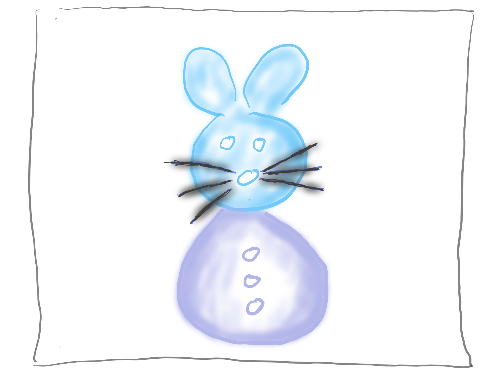

# Markdown

I am a [Markup-Language](9300000.md).

## About

- My Creator is [John_Gruber](30.md).
- My Creator is [Aaron_Swartz](404.md).

## Media-Files

We use the following Markdown-Tag for Media-Files:

```

```

For our [Simple Mouse](404.md) the following Code ...

```markdown

```

... leads to this Output:


## Links

- Wikipedia: [Https://En.WikiPedia.Org](https://en.wikipedia.org/wiki/Markdown)
- Wikidata: [Https://WikiData.Org](https://wikidata.org/wiki/Q1193600)
